# Energy Compass — states and strategies guide

**English** · [Polski](guide.pl.md)

This guide explains what Energy Compass does, every state its entities can report and the
conditions that produce each state, and the six dispatch strategies. It describes release
**0.1.25**. The mathematical contract behind each rule lives in [model and limitations](model.md);
installation and dashboards are in the [installation guide](installation.md).

Energy Compass is **advisory**. It computes a plan and publishes it as Home Assistant entities. It
never writes inverter registers and sends no messages by itself; controllers and notification
blueprints decide whether to act on the plan. The repository ships one such controller, for Deye
inverters through Solarman: see [Deye inverter controller](#deye-inverter-controller-solarman).

## Contents

1. [How it works](#how-it-works)
2. [Entity overview](#entity-overview)
3. [Optimizer status — calculation lifecycle](#optimizer-status--calculation-lifecycle)
4. [Alert and forecast validity](#alert-and-forecast-validity)
5. [Operating modes — the planned battery state](#operating-modes--the-planned-battery-state)
6. [Consumption levels — BOOST, CHEAP, NORMAL, LIMIT](#consumption-levels--boost-cheap-normal-limit)
7. [Windows and flexible energy depth](#windows-and-flexible-energy-depth)
8. [Dispatch strategies](#dispatch-strategies)
9. [Automatic strategy switching](#automatic-strategy-switching)
10. [Window notifications](#window-notifications)
11. [Deye inverter controller (Solarman)](#deye-inverter-controller-solarman)
12. [Reason code reference](#reason-code-reference)

## How it works

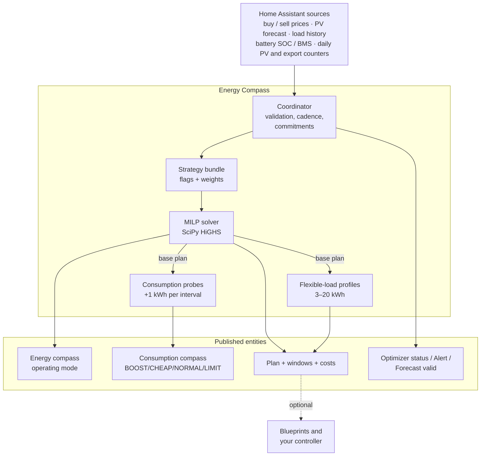

Each calculation proceeds as follows:

1. **Snapshot and validate inputs.** Prices, PV forecast, load forecast (from recorder history),
   battery SOC and daily counters are read and checked for freshness, units and plausibility.
2. **Build the problem.** Native tariff slots (typically 15 min) over the planning horizon (24 h by
   default), hardware limits, SOC bounds, the carried operating-mode commitment and the active
   **strategy** bundle.
3. **Solve the base plan.** A mixed-integer linear program minimizes cost (plus strategy weights)
   under energy balance, battery, grid, mode-duration and export/charge-policy constraints. Only a
   proven optimum is published.
4. **Probe consumption.** For each display interval, the solver is rerun with 1 kWh of extra load;
   the cost difference is the *incremental cost of one more kWh*, which is classified into a
   consumption level.
5. **Profile flexible loads.** Separate solves for 3, 5, 10, 15 and 20 kWh blocks measure how much
   flexible energy can be scheduled before the price degrades.
6. **Publish.** One coherent generation updates all entities; unchanged entities are not rewritten.

### Recalculation cadence

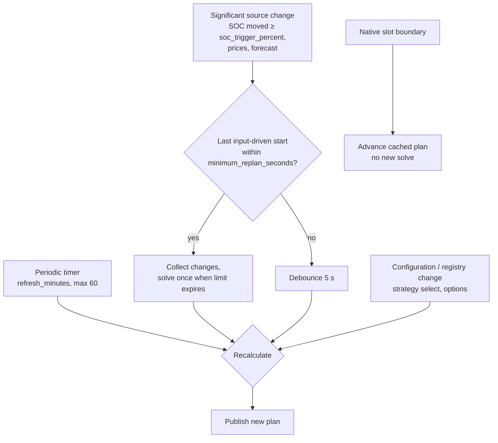

- **Periodic:** `refresh_minutes` (default 15, max 60) aligned to the wall clock.
- **Input-driven:** at most once per `minimum_replan_seconds` (default 900 s, `0` disables) while a
  valid plan is retained; SOC counts as changed only after moving `soc_trigger_percent` (default
  5 %) from the value that started the last calculation.
- **Boundaries:** at each native settlement boundary the existing plan advances (consumed rows are
  dropped, mode clocks tick) without a solve.
- **Plan lifetime:** a new plan is valid until `generated_at + 2 × refresh_minutes`, capped by
  forecast coverage.

## Entity overview

`<name>` is the integration entry's title.

| Entity | EN name | PL name | State |
| --- | --- | --- | --- |
| `sensor.<name>_consumption_compass` | Consumption compass | Kompas zużycia | `BOOST` / `CHEAP` / `NORMAL` / `LIMIT` |
| `sensor.<name>_consumption_cost` | Consumption cost | Koszt zużycia | currency/kWh of one more kWh now |
| `sensor.<name>_flexible_energy_depth` | Flexible energy depth | Głębokość elastycznego zużycia | kWh |
| `sensor.<name>_next_change` | Next change | Następna zmiana | timestamp of next level change |
| `sensor.<name>_next_boost_start` | Next boost start | Początek zwiększonego zużycia | timestamp |
| `sensor.<name>_next_cheap_start` | Next cheap start | Początek taniego okresu | timestamp |
| `sensor.<name>_next_limit_start` | Next limit start | Początek ograniczenia | timestamp |
| `sensor.<name>_energy_compass` | Energy compass | Kompas energii | one of six operating modes |
| `sensor.<name>_plan` | Plan | Plan | generation timestamp + full plan attributes |
| `sensor.<name>_expected_net_cost` | Expected net cost | Przewidywany koszt netto | currency over the horizon |
| `sensor.<name>_expected_wear_cost` | Expected wear cost | Przewidywany koszt zużycia baterii | currency over the horizon |
| `sensor.<name>_optimizer_status` | Optimizer status | Stan optymalizatora | calculation status (diagnostic) |
| `sensor.<name>_battery_balance` | Battery balance | Balansowanie baterii | `ok` / `eligible` / `scheduled` / `holding` / `overdue` (diagnostic) |
| `binary_sensor.<name>_forecast_valid` | Forecast valid | Poprawna prognoza | `on` / `off` |
| `binary_sensor.<name>_alert` | Alert | Alert | `on` / `off` (diagnostic, problem) |
| `select.<name>_strategy` | Strategy | Strategia | one of six strategies |

Cost sensors can be disabled with **Presentation → Expose costs**, window timestamps with
**Expose windows**, and flexible depth with **Consumption outlook → Enable flexible energy depth**.
Battery balance is disabled by default and enabled with the **LFP balance** setting; its
attributes carry `last_completed`, `next_due`, `days_overdue`, `planned_start`, `planned_end`,
`planned_mode`, `hold_progress_minutes`, `hold_required_minutes` and `threshold_percent`.

### Availability rule

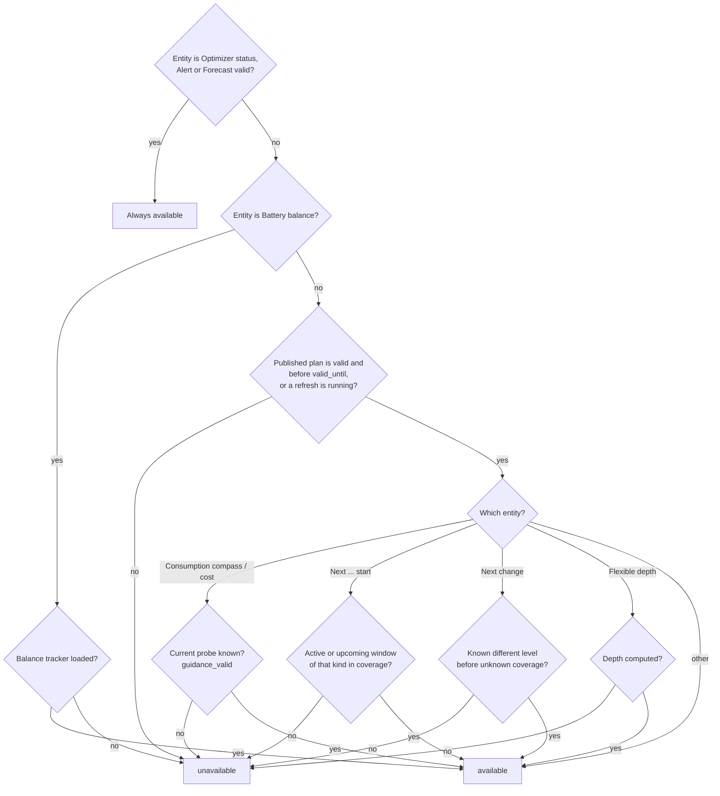

## Optimizer status — calculation lifecycle

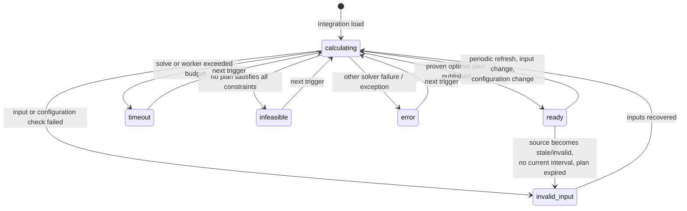

| State | EN / PL label | When it occurs | What stays published |
| --- | --- | --- | --- |
| `ready` | Ready / Gotowy | The last calculation produced a proven optimal base plan and it was published. | The new plan. `ready` does not guarantee complete reference coverage — check `reason`. |
| `calculating` | Calculating / Obliczanie | A calculation is queued or running. `reason` says why: `inputs_changed`, `interval_boundary` (periodic refresh due), `inputs_recovered`, `calculating` (worker started), `soc_rebase_pending` (upward SOC jump awaiting confirmation). | The previous plan while it covers now, with `refreshing: true`. An existing alert stays on. |
| `invalid_input` | Invalid input / Niepoprawne dane | A required source is missing, unavailable, stale, in wrong units, out of range, SOC disagrees with BMS or jumped, daily counters are from the previous day, settings are invalid; also `no_current_interval` and `expired_inputs` when the retained plan no longer covers now. | The previous plan while it covers now (`plan_retained: true`); otherwise nothing. |
| `timeout` | Timeout / Przekroczony czas | The base solve exceeded `solve_time_limit_s` (default 10 s) or the worker exceeded `total_time_limit_s + 1` (reason `worker_deadline`). | Previous plan within coverage. |
| `infeasible` | Infeasible / Brak rozwiązania | The solver proved no plan satisfies every hard constraint (e.g. SOC reserve, terminal rule, a carried mode commitment, Sell only PV deficit, grid limits). | Previous plan within coverage. |
| `error` | Error / Błąd | Any other solver failure or unexpected exception; `reason` holds the solver reason or exception class. | Previous plan within coverage. |
| `insufficient_data` | Insufficient data / Za mało danych | Reserved in translations; **not emitted** by the current coordinator — missing data reports `invalid_input`. | — |

Attributes: `last_calculation_started_at`, `calculations_since_load`,
`expired_previous_generated_at`. Diagnostics add `calculations_last_hour` and
`calculations_last_24h`.

### Superseded results

If inputs change while a solve runs, the finished result is still published when only inputs (not
configuration) changed — it is fresher than the retained plan — and a new solve follows.
Configuration, registry and invalid-input changes discard in-flight results.

## Alert and forecast validity

### Forecast valid (`binary_sensor.<name>_forecast_valid`)

| State | Condition |
| --- | --- |
| `on` | A published plan exists and `now < valid_until`. This holds during retries and while a retained plan still covers now. |
| `off` | No plan, or its coverage/lifetime has ended. Recommendations become unavailable. |

Attribute `current_guidance_valid` is `true` only when the consumption probe for the current
interval produced a known level. Other attributes: `coverage_end`, `requested_end`,
`coverage_complete`, `input_ages`, `missing_sources`, `load_quality`.

### Alert (`binary_sensor.<name>_alert`)

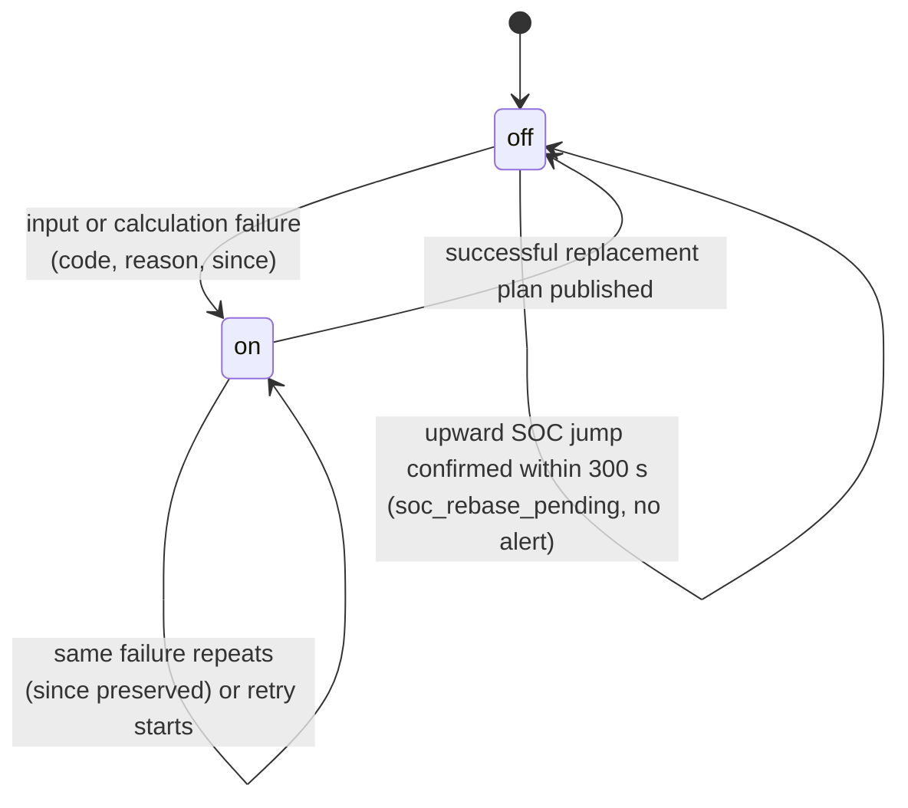

| `code` | EN / PL | Condition |
| --- | --- | --- |
| `invalid_input` | Invalid input / Nieprawidłowe dane wejściowe | Any input validation failure (see optimizer status). |
| `soc_measurement_jump` | SOC measurement jump / Skok wskazania SOC | Between two reports SOC changed by more than battery power × elapsed time + `soc_jump_percent` (default 2 %) of capacity. Downward jumps alert immediately; upward jumps (BMS recalibration near full) first show `calculating`/`soc_rebase_pending` and alert only if not confirmed within 300 s. Recovery needs fresh plausible reports spanning ≥ 60 s. |
| `timeout` | Calculation timeout / Przekroczony czas obliczeń | Solve or worker deadline exceeded. |
| `infeasible` | No feasible plan / Brak wykonalnego planu | No plan satisfies the hard constraints. |
| `error` | Calculation error / Błąd obliczeń | Other failure. |

Attributes: `code`, `reason`, `since`, `plan_retained`, `last_successful_plan_at`. A retry does
not clear the alert; only a successful new plan does.

### Plan retention

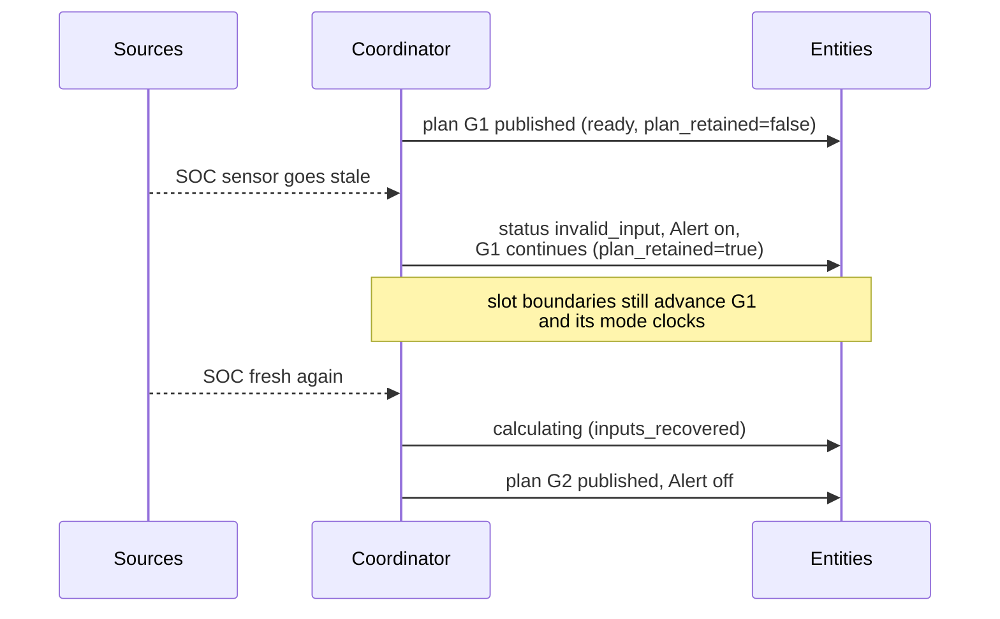

A retained plan is never extended beyond its original coverage and is not carried across an
integration reload or Home Assistant restart.

## Operating modes — the planned battery state

The **Energy compass** sensor shows the operating mode of the current interval; every row of the
plan's `intervals` attribute carries `dispatch_mode`. There are six modes. Per interval of `h`
hours: `activity = minimum_mode_power_kw × h` (default 0.1 kW) and
`surplus = max(PV − load, 0)`.

| Mode | EN meaning | Occurs when (physical flows) | Allowed only if |
| --- | --- | --- | --- |
| `CHARGE_GRID` | Charge from grid | Battery charge ≥ surplus + activity — more is charged than PV surplus can supply, so the grid feeds the battery. No discharge, no curtailment. | `allow_grid_charge` on; price ≤ grid-charge ceiling when that limit is on. |
| `CHARGE_PV` | Charge from PV | activity ≤ charge ≤ surplus — only solar surplus charges. No discharge, no curtailment. | PV surplus exists. |
| `DISCHARGE_GRID` | Discharge with export | Discharge ≥ activity **and** grid export ≥ activity — the battery sells energy. | `allow_battery_export` on; grid export capacity > 0; Sell only PV budget and export-benefit hurdle allow it. |
| `SELF_CONSUME` | Self-consumption | Discharge ≥ activity, no charge, no export, no curtailment — the battery covers the house. | SOC above operating reserve. |
| `HOLD` | Hold | No charge, no discharge, no curtailment — the battery idles; the grid/PV cover load. | Always available. |
| `CURTAIL` | Curtail PV | Curtailment ≥ activity, no battery activity. | `allow_curtailment` on. |

When mode duration is disabled (`minimum_mode_minutes = 0`), the display state is derived from flows
by precedence: CURTAIL → CHARGE_GRID → CHARGE_PV → DISCHARGE_GRID → SELF_CONSUME → HOLD.

A planned [LFP balance hold](#lfp-balance-charge) does not add a mode: its rows reuse `CHARGE_PV` or
`CHARGE_GRID` and carry `balance_hold: true` in the plan's `intervals` attribute.

### Transitions and minimum duration

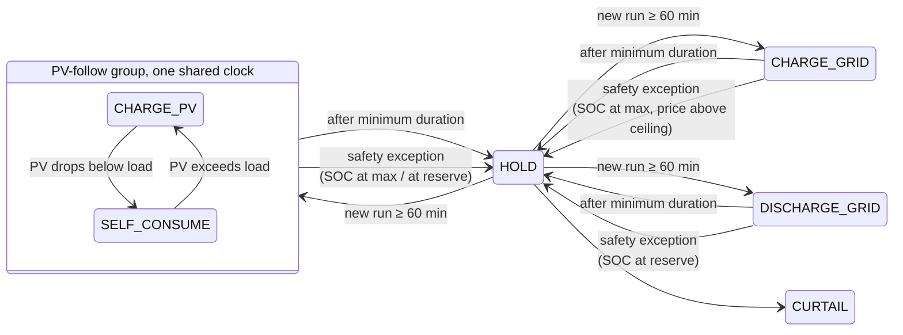

The diagram is simplified with HOLD as a hub: after its minimum duration any mode may be followed
directly by any other available mode.

Rules (defaults: 60 min, 0.1 kW):

- **Every newly started mode — including HOLD and CURTAIL — lasts at least
  `minimum_mode_minutes`.** Only a final passive HOLD/CURTAIL run may be clipped by coverage. The coordinator persists the
  accepted mode and its start; recalculation and restart preserve the clock.
- **PV-follow group:** `CHARGE_PV` and `SELF_CONSUME` share one clock — in both the inverter
  charges from surplus and covers a deficit from the battery, so flipping between them is not a
  mode change.
- **Any other change** (source, destination, HOLD or CURTAIL) starts a new clock. Idle HOLD cannot
  fund an active run.
- **Coverage:** a new active mode needs a full duration of forecast coverage remaining.
- **Safety exception (pause, not reset):** during an unexpired active commitment the current row
  shows HOLD when the observed SOC is already at the upper bound (charging modes —
  `observed_soc_maximum`) or at/below the reserve (discharge modes — `observed_soc_minimum`), or
  when a carried `CHARGE_GRID` meets a price above the ceiling before its deadline
  (`grid_charge_price_limit`). The interrupted mode and deadline stay stored; no other mode may
  start before that deadline. Exposed in `dispatch_policy.safety_exception`.
- **Strategy change (reset):** writing a new strategy drops the carried commitment for the next
  plan, which starts unlocked (see [strategy-switch release](#strategy-switch-release)).
- Setting `minimum_mode_minutes = 0` disables duration and minimum-power rules.

### Policies that gate modes

| Policy | Default | Effect |
| --- | --- | --- |
| **Sell only PV** (`limit_export_to_pv`) | on | Per local day: exported energy ≤ PV generated (observed since midnight + forecast). Requires `pv_energy_today` and `grid_export_energy_today` counters. |
| **Limit grid-charging price** (`limit_grid_charge_price`, `maximum_grid_charge_price`) | off | CHARGE_GRID only at buy price ≤ ceiling for its whole minimum duration. |
| **Minimum export benefit** (`minimum_export_episode_benefit`) | 1 currency unit | Each additional battery-export period must improve full-horizon cost by at least this amount. `0` disables. |
| **Minimum grid-charge episode benefit** (`minimum_grid_charge_episode_benefit`) | 0 (off) | Same hurdle for new grid-charge periods; consolidates charging into fewer episodes. |
| **Import penalty** (`import_penalty_per_kwh`) | 0 | Planning-only shadow price per imported kWh, under every strategy. |
| **Inverter standby loss** (`idle_drain_kw`) | 0 (off) | Constant battery drain modelled per interval. |
| **Terminal rule** (`terminal_mode`) | `preserve_initial` | End SOC ≥ start SOC, or `value`: stored energy at the end is credited at `terminal_value_per_kwh`. |

## Consumption levels — BOOST, CHEAP, NORMAL, LIMIT

The **Consumption compass** answers "how attractive is using one more kWh in this interval?". For
each display interval (default 60 min over 24 h) the solver reruns with `probe_kwh` (default
1 kWh) of extra load. **Consumption cost** = (probe plan cost − base plan cost) ÷ added kWh. Because
the battery and grid are re-optimized, this is the true marginal cost — it can differ from the
tariff price (e.g. solar that would otherwise be exported costs its lost export value).

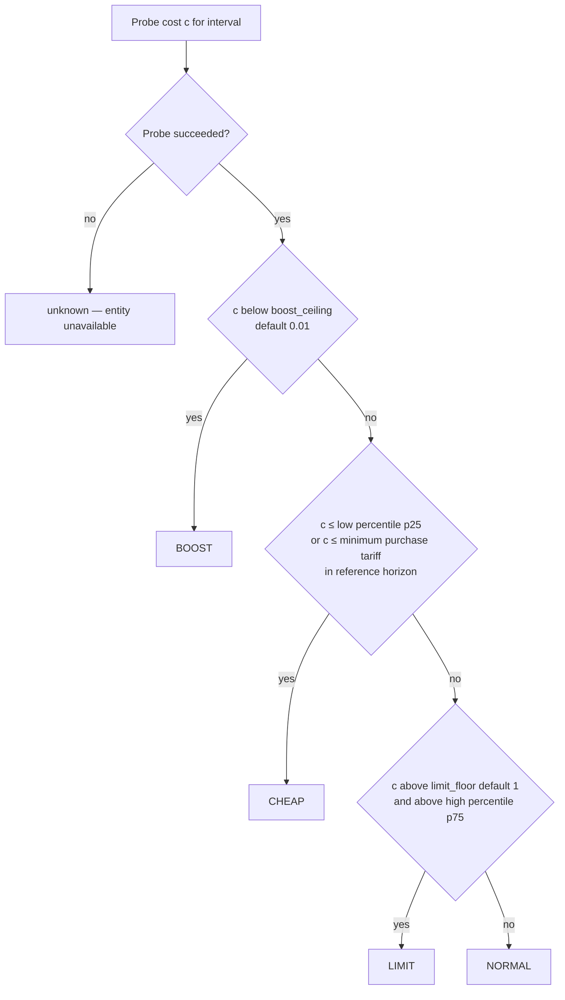

| Level | EN / PL | Condition | Typical situation |
| --- | --- | --- | --- |
| `BOOST` | Boost / Zwiększone zużycie | Cost strictly below `boost_ceiling` (default 0.01 currency/kWh). | Free or negative energy: surplus PV that cannot be stored or exported, negative prices. Run everything you can. |
| `CHEAP` | Cheap / Tanio | Not BOOST, and cost ≤ `cheap_percentile` (default 25th) of reference costs, **or** ≤ the minimum purchase tariff in the reference horizon. | Among the cheapest hours of the reference window. Good time for flexible loads. |
| `LIMIT` | Limit / Ograniczenie | Cost strictly above both `limit_floor` (default 1 currency/kWh) and the `limit_percentile` (default 75th). | Expensive peak — extra use forces costly import or loses valuable export. Postpone. |
| `NORMAL` | Normal / Normalnie | Anything else. | Average conditions. |
| unknown | — | The probe failed or ran out of time, or the interval lies beyond forecast coverage. | Entity unavailable; later windows can still be known. |

Percentiles come from successful probe costs across the reference horizon (default 24 h) using
linear interpolation. If a full reference probe fails, `short_coverage` decides: `absolute_fallback`
(default: keep BOOST/LIMIT absolute rules and the minimum-tariff CHEAP rule) or `unavailable`.

## Windows and flexible energy depth

### Windows

Adjacent intervals of the same level merge into windows. `next_boost_start`, `next_cheap_start`
and `next_limit_start` show the start of the active or next window of that kind; `next_change` shows
the next known different level.

| Attribute `status` | Condition |
| --- | --- |
| `active` | Window start ≤ now < end. |
| `upcoming` | Window starts later within coverage. |
| `none_in_coverage` | No such window in the forecast; the entity is unavailable. |

`start_basis` is `forecast`, or `first_observed` when an already active window keeps its first
observed start across recalculations and restarts. `next_change` stops at unknown coverage rather
than guessing.

### Flexible energy depth

Answers "how much deferrable energy can I use cheaply?". The solver independently places 3, 5, 10,
15 and 20 kWh blocks at up to `flexible_load_max_power_kw` (default 3 kW).

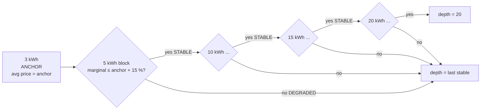

| Profile status | Condition |
| --- | --- |
| `ANCHOR` | The 3 kWh profile; its average incremental cost is the anchor price. |
| `STABLE` | Marginal block cost ≤ anchor + `flexible_price_degradation_percent` (default 15 %) of |anchor|. |
| `DEGRADED` | Marginal block cost above that threshold — stops the published depth. |
| `UNKNOWN` | Not solved: `insufficient_time` (block cannot fit at max power within the horizon), `timeout`, or a solver reason. Stops the depth. |

Groups: `small` (3/5 kWh), `medium` (10/15 kWh), `large` (20 kWh).

## Dispatch strategies

`select.<name>_strategy` chooses which objective bundle the solver uses. Every strategy keeps all
hard physical constraints; strategies change only **planning weights** and a small set of
**policy flags**. Reported costs (`expected_net_cost`, consumption cost) always stay real currency —
strategy penalties never appear in them.

| Strategy | EN / PL label | Goal | Typical use |
| --- | --- | --- | --- |
| `cost_min` | Cost minimisation / Minimalizacja kosztów | Lowest total cost | Default, everyday |
| `self_sufficiency` | Self-sufficiency / Samowystarczalność | Fewest grid kWh | Flat prices, off-grid preference, zero/negative prices |
| `backup_ready` | Backup ready / Gotowość awaryjna | Keep a high reserve | Storm warning, planned outage, winter |
| `pv_swap` | PV swap / Zamiana energii PV | Buy cheap at night, sell own PV later | Small winter PV with an evening sell premium |
| `max_export` | Maximum export / Maksymalny eksport | Unrestricted arbitrage | High sell-price windows |
| `grid_friendly` | Grid friendly / Przyjazna dla sieci | Flatten import/export peaks | Capacity tariffs, weak connection |

### What each strategy changes

The solver minimizes

```text
grid     = Σ ( import_weight × buy × import + import_kwh_weight × import
               − export_weight × (sell − pv_export_margin) × export )
           + battery_export_penalty_per_kwh × battery_export
autonomy = soc_target_weight × Σ (deepest shortfall per window below the autonomy floor)
peak     = peak_import_weight × max(import power)
caps     = cap_violation_weight × Σ (import/export above soft caps)
objective = grid + wear + episode hurdles + autonomy + peak + caps − terminal credit
```

| Strategy | Autonomy floor | Sell only PV | Grid-charge ceiling | Export-benefit hurdle | Weights |
| --- | --- | --- | --- | --- | --- |
| `cost_min` | off | user setting | user setting | user setting | defaults (only `import_penalty_per_kwh`) |
| `self_sufficiency` | **on** | user setting | user setting | user setting | `import_kwh_weight` = max(5.0, max \|buy\| + 0.50, import penalty); battery-export penalty 0.20/kWh |
| `backup_ready` | **on**, floor ≥ 80 % capacity | user setting | user setting | user setting | floor weight ≥ 2.0/kWh |
| `pv_swap` | **on** | **forced on** | **forced off** | user setting | sell price reduced by margin 0.05/kWh |
| `max_export` | **off** | **forced off** | **forced off** | **forced 0** | defaults |
| `grid_friendly` | **off** | user setting | user setting | user setting | peak import 0.50/kW, soft-cap violation 2.0/kWh |

"User setting" means the strategy leaves the option as configured. **Forced** values apply only to
options the user has not set explicitly: any strategy-owned option that deviates from its shipped
default is recorded in `explicit_strategy_fields` and is never overridden by a bundle.

All numbers above are defaults of Planning options:
`self_sufficiency_import_price_per_kwh` (5.0), `self_sufficiency_export_penalty_per_kwh` (0.20),
`backup_target_soc_percent` (80), `backup_shortfall_price_per_kwh` (2.0),
`pv_swap_margin_per_kwh` (0.05), `peak_import_price_per_kw` (0.50),
`cap_violation_price_per_kwh` (2.0), `grid_friendly_import_cap_kw` / `_export_cap_kw` (0 = site
connection limit), `autonomy_margin_per_kwh` (0.10).

### Autonomy floor (used by `self_sufficiency`, `backup_ready`, `pv_swap`)

The floor asks: *will the battery carry the house through the next period where load exceeds
PV?* The horizon is split into windows by cumulative net surplus; within each window the target is

```text
soc_target[t] = min(usable capacity, reserve + (1 / η_discharge) × Σ deficit until window end)
```

The deepest shortfall below the target is billed **once per window** at `soc_target_weight` =
expected night rebuy price (median night buy price) + `autonomy_margin_per_kwh`. The floor looks
48 h ahead on PV/load forecasts even before tomorrow's prices are published. It is **soft**:
violations become `autonomy_shortfall_kwh` on the plan instead of an infeasible solve. It needs a PV
source (`autonomy_floor_requires_pv` otherwise).

### LFP balance charge

LFP packs need a periodic full charge and a short hold at the top so the BMS can
balance cells and re-anchor its SOC. With **Periodic LFP balance charge**
(`lfp_balance`) on, Energy Compass tracks the last completed balance and plans
the next one. The tracker itself keeps observing SOC and advancing its state even
while `lfp_balance` is off; turning the setting on only starts publishing balance
windows and the diagnostic sensor.

| Setting | Default | Meaning |
| --- | --- | --- |
| `balance_interval_days` | 7 | Days between completed balances |
| `balance_hold_minutes` | 60 | Minutes SOC must stay at or above the threshold |
| `balance_soc_threshold` | 99 % | SOC that counts as full |
| `balance_value` | 5.0 | Value of balancing on the due day |

A balance **completes** after SOC stays at or above the threshold for the whole
hold. A reading below the threshold restarts the hold. Only observed time
counts: an unavailable or stale SOC gives no credit, and two full readings more
than `soc_max_age_seconds` apart restart the hold from the later one (a hold
whose last full reading is older than that is neither holding nor complete).
Completion is evaluated lazily — while full readings keep arriving, the hold
completes on the next check without needing a state change. Phases: `ok` →
`eligible` (the earlier of 2 days or half the interval before due) → `due`;
`holding` overlays whichever phase is active while a hold is running. A hold that
starts while the balance is still `ok` (for example SOC back at 100 % the day
after a balance) is tracked and completes, but is not scheduled: the optimizer
gets no hold window and no miss cost for it.

The optimizer may pick one hour-aligned hold window: candidate windows start only
on the whole hour, and while `due`, only within the next 24 h (an `eligible`
balance may look anywhere across the horizon). Inside the chosen window SOC stays
at or above the threshold and the battery does not discharge. Skipping costs 10 %
of `balance_value` while eligible — small, so the planner normally balances only
on cheap or free energy, but it still picks a grid window that costs less than
that — `balance_value × (1 + days overdue)` once due, and 10 × `balance_value`
during a hold that is eligible or due. A window is published as **CHARGE_PV**
only when PV covers load in every one of its slots; otherwise (mixed PV/grid or
pure grid, such as a night window) it is **CHARGE_GRID**, which additionally
requires grid charging to be allowed and the grid-charge price ceiling (if any)
to pass in every slot — with `balance_hold: true` on every row. From the slot before the earliest candidate
window to the horizon end, the battery's energy may rise up to full capacity
instead of the configured SOC ceiling, so a hold is never blocked by
`soc_ceiling` below 100 %; that lift only matters when the ceiling is below
100 %. Consumption probes keep the chosen window fixed so a probe's extra load
prices the load, not the balance choice.

The **Battery balance** diagnostic sensor (`sensor.<name>_battery_balance`)
reports `ok`, `eligible`, `scheduled`, `holding` or `overdue`, with
`last_completed`, `next_due`, `days_overdue`, `planned_start`, `planned_end`,
`planned_mode`, `hold_progress_minutes`, `hold_required_minutes`,
`threshold_percent`.

### `cost_min` — cost minimisation

- **Goal:** lowest forecast cost: purchases − sales + battery wear − terminal credit.
- **Changes:** nothing; byte-identical to the plain model when `import_penalty_per_kwh = 0`.
- **Behaviour:** charges when energy is cheap (grid or PV), discharges into expensive hours,
  exports only when the spread beats losses, wear and the export-benefit hurdle.
- **Choose when:** everyday operation; the default and the fallback of the switch blueprint.
- **Watch out:** it may leave the battery low before a cheap-looking night if forecasts are
  wrong — no autonomy reserve.

### `self_sufficiency` — self-sufficiency

- **Goal:** minimize **grid kWh**, not currency.
- **Changes:** every imported kWh costs at least `max(5.0, highest |buy price| + 0.50,
  import_penalty_per_kwh)`, so import always dominates price differences; battery export costs an
  extra 0.20/kWh; autonomy floor on.
- **Behaviour:** fills the battery from PV, avoids grid charging and battery export unless needed,
  keeps enough energy for the next deficit window.
- **Choose when:** day/night price spread is small (the blueprint picks it when the spread is
  below 0.15 PLN/kWh), when prices are zero or negative, or when independence matters more than
  cost.
- **Watch out:** reported costs stay real — this strategy can cost more money than `cost_min`.

### `backup_ready` — backup ready

- **Goal:** keep a large reserve for an outage.
- **Changes:** autonomy floor on and raised to at least `backup_target_soc_percent` (80 %) of
  capacity; its weight is at least `backup_shortfall_price_per_kwh` (2.0/kWh).
- **Behaviour:** refills to ~80 % and avoids discharging below it unless the shortfall is worth
  more than 2.0/kWh; the floor stays soft, so a plan always exists.
- **Choose when:** storm or grid-outage warnings, planned maintenance, cold winter nights. The
  blueprint's `alert` rule selects it when your alert entity is on.
- **Watch out:** combining it with a low grid-charge ceiling raises
  `grid_charge_ceiling_below_autonomy_weight` — the floor could be emptied but never refilled.

### `pv_swap` — PV swap

- **Goal:** in low-PV seasons, buy cheap at night and sell the day's real PV output at a later,
  higher price.
- **Changes:** `pv_export_margin` (0.05/kWh) is subtracted from every sell price (the export must
  beat the night buy by at least that margin); **Sell only PV forced on** (daily export ≤ daily PV);
  **grid-charge ceiling forced off** (so night charging is not blocked); autonomy floor on.
- **Behaviour:** grid-charges overnight, lets the day's PV cover the house, then exports up to the
  day's generated PV in the evening peak.
- **Choose when:** tomorrow's PV forecast is below the daily load and `evening sell × round-trip
  efficiency ≥ night buy + margin` (the blueprint's `pv_swap` rule).
- **Watch out:** Sell only PV counts energy, not provenance — exported battery energy is limited in
  total to the day's PV, not traced to its origin.

### `max_export` — maximum export

- **Goal:** pure arbitrage, maximize revenue from exports.
- **Changes:** **export-benefit hurdle forced to 0**, **Sell only PV forced off** (grid-charged
  energy can be resold), **grid-charge ceiling forced off**, autonomy floor off.
- **Behaviour:** charges whenever buy is low, discharges into the grid whenever the spread covers
  losses and wear; may do several export episodes a day.
- **Choose when:** exceptional sell prices, a tariff that rewards export.
- **Watch out:** most battery cycles; check whether your contract allows reselling grid energy.
  Never selected automatically.

### `grid_friendly` — grid friendly

- **Goal:** flatten the grid profile — avoid high import peaks and limit export power.
- **Changes:** peak import term `peak_import_price_per_kw` (0.50/kW of the highest import power);
  soft import/export caps `grid_friendly_import_cap_kw` / `grid_friendly_export_cap_kw` (0 = site
  limit), each kWh above them costs `cap_violation_price_per_kwh` (2.0); autonomy floor off.
- **Behaviour:** spreads grid charging over longer windows, uses the battery to shave import
  peaks, keeps export under the cap.
- **Choose when:** capacity/power-based tariffs, a weak connection or a fuse near its limit.
- **Watch out:** caps are soft; excess is reported in `cap_violation_kwh` instead of failing.
  Never selected automatically.

### Plan attributes for strategies

| Attribute | Meaning |
| --- | --- |
| `strategy` | Strategy that produced this plan (may lag the select while a recalculation runs). |
| `autonomy_shortfall_kwh` | Total shortfall below the autonomy floor; `0` = floor met. |
| `cap_violation_kwh` | Total energy above `grid_friendly` soft caps; `0` = caps met. |

### Strategy-switch release

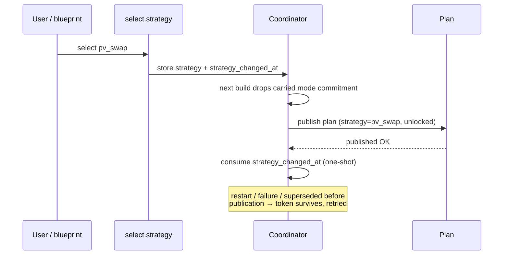

A strategy change is a **reset**: the carried mode commitment is released so the new strategy is
not trapped in the old mode's minimum duration. A current export episode is kept so its hurdle is
not charged twice.

## Automatic strategy switching

The optional blueprint [`strategy_switch.yaml`](../blueprints/automation/energy_compass/strategy_switch.yaml)
picks one strategy per day. It runs at **14:05** (after RCE next-day prices and Solcast), retries
hourly until **20:00** if next-day prices are missing, and reconciles a half-applied write at Home
Assistant start.

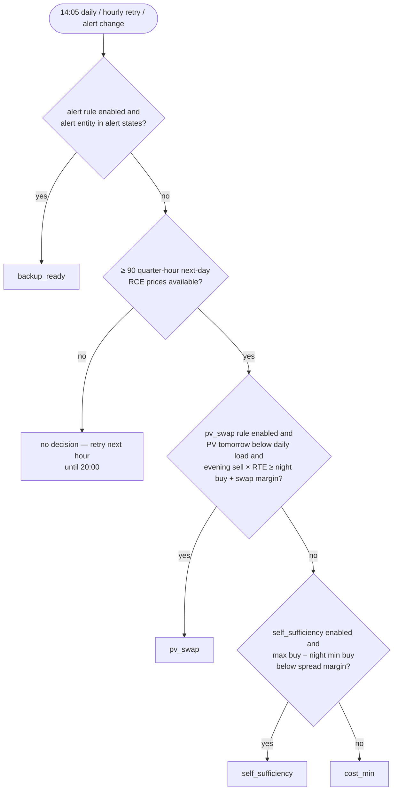

| Input | Default |
| --- | --- |
| Night window | 22:00–06:00 (lowest buy price in plan intervals) |
| Max buy | highest buy price across all plan intervals |
| Evening window | 17:00–21:00 (max sell price from RCE next day) |
| Round-trip efficiency | 0.90 |
| Self-sufficiency spread margin | 0.15 PLN/kWh |
| PV swap margin | 0.05 PLN/kWh |
| Enabled rules | `alert`, `pv_swap`, `self_sufficiency` (`cost_min` is the fallback) |

A **manual** change of the select blocks the economic rules until the next successful scheduled
run; the alert rule is never blocked. `max_export` and `grid_friendly` are manual-only. Setup
details: [installation guide](installation.md#import-the-strategy-switch-blueprint).

## Window notifications

The optional blueprint [`notifications.yaml`](../blueprints/automation/energy_compass/notifications.yaml)
tells the household when extra use is cheap (favorable window) or when an expensive `LIMIT` window
is starting. Energy Compass itself never sends anything; **Notify enabled** in the integration
options is the master switch. Setup: [installation guide](installation.md#opt-in-notifications).

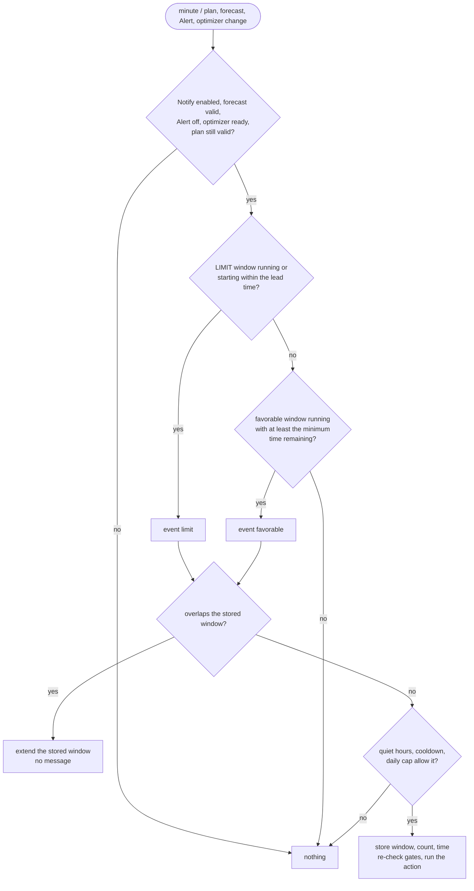

| Message | When |
| --- | --- |
| **Use the cheap energy** / *Wykorzystaj tanią energię* | a favorable window is running and the whole rest of it is `BOOST` |
| **A good time for household appliances** / *Dobry moment na domowe urządzenia* | a favorable window is running, not all `BOOST` |
| **Plan heavy use for later** / *Zaplanuj większe zużycie na później* | a `LIMIT` window starts within the lead time, or is already running |

The message names the window's local times and suggests moving laundry, the dishwasher or car
charging. The action receives `notification_title`, `notification_message` and `event_kind`.

| Input | Meaning |
| --- | --- |
| `compass`, `plan`, `forecast_valid`, `alert`, `optimizer_status` | Consumption compass, Plan, Forecast valid, Alert and Optimizer status of one installation |
| `next_boost`, `next_cheap`, `next_limit` | the three window start sensors (their changes re-run the automation) |
| `last_favorable`, `last_limit` | Text helpers (max 255) holding the last window as `{"s": start, "e": end}` |
| `daily_count`, `daily_date`, `last_sent` | Number helper and two Date/time helpers for the daily cap and cooldown |
| `language` | `en` or `pl` for the title and message |
| `use_blueprint_overrides` | off: use the integration's notification preferences; on: use the inputs below |
| `enabled_events`, `minimum_hours`, `limit_lead_minutes`, `quiet_start`, `quiet_end`, `cooldown_minutes`, `daily_cap` | overrides: events, minimum favorable time remaining, LIMIT lead, quiet hours, cooldown, messages per local day |
| `notification_actions` | the action to run, for example a mobile app notify action |

## Deye inverter controller (Solarman)

Energy Compass itself never writes to an inverter. The optional blueprint
[`deye_solarman_controller.yaml`](../blueprints/automation/energy_compass/deye_solarman_controller.yaml)
does: it executes the plan on a Deye hybrid inverter through the
[Solarman integration](https://github.com/davidrapan/ha-solarman), writing three battery currents and
the six time-of-use (TOU) programs, and reads every write back from the holding registers. It needs the
companion package [`energy_compass_deye.yaml`](../packages/energy_compass_deye.yaml). Setup steps are in
the [installation guide](installation.md#deye-inverter-controller). Both files are generated by
`tools/deye_controller/build.py`; edit the generator, not the YAML.

### Package entities

| Entity | Role |
| --- | --- |
| `input_select.energy_compass_deye_mode` | **Off** / **Simulation** / **Auto**; the only switch you operate |
| `input_boolean.energy_compass_deye_session` | on once a control session has started (Home Assistant start or first run) |
| `input_datetime.energy_compass_deye_session_start` | session start; only plans generated after it are accepted |
| `input_boolean.energy_compass_deye_restore_pending` | on from the first write until the base profile is confirmed again |
| `sensor.energy_compass_deye_plan` | the accepted plan snapshot (attribute `snapshot`) |
| `sensor.energy_compass_deye_runtime` | runtime code (below); attribute `runtime` holds state, reason, confirmed values and uncertain registers |
| `sensor.energy_compass_deye_tou_settings` | the TOU program prefix (attribute `prefix`) and current program values; a change re-runs the controller |
| `sensor.energy_compass_deye_next_tou` | next local TOU program boundary |
| `sensor.energy_compass_deye_deadline` | `valid_until` of the accepted plan |
| `sensor.energy_compass_deye_interval_end` | end of the current plan interval |

The package assumes Solarman's default TOU entity names (`number.inverter_deye_program_1_power` …
`time.inverter_deye_program_6_time`). For another device name, generate the package with your prefix in
the [YAML builder](builder.html) or with `python tools/deye_controller/build.py --prefix my_inverter_program_`.

### Modes

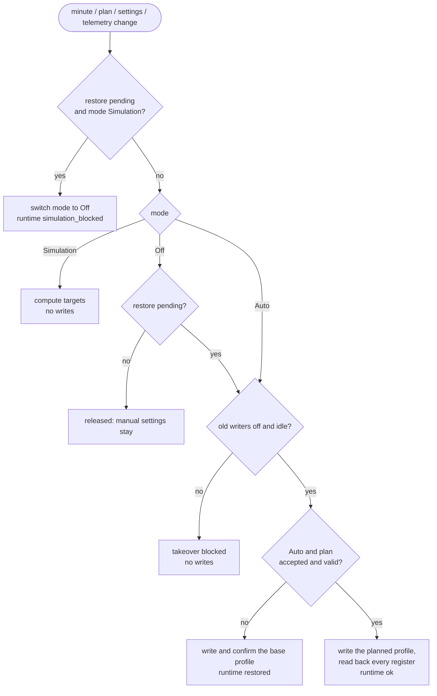

**Auto** writes; **Simulation** computes every target and records it in `runtime` without touching the
inverter; **Off** releases control. Leaving Auto for Off restores the base profile once, confirms it,
then leaves later manual settings alone. Disabling the *automation* skips that restore. A switch to
Simulation while a restore is pending is refused: the mode goes to Off, the base profile is restored,
and Simulation can then be chosen again.

### Plan acceptance

A plan is accepted only when all of these hold: it was generated after the session start and after the
last revocation, it is newer than the cached plan, Forecast valid is `on`, Alert is `off`, the optimizer
is `ready` (or `calculating` while retaining a complete plan), the plan, optimizer and forecast report
the same `generated_at`, its intervals are contiguous and cover now, and `valid_until` is in the future.
An optimizer outside `ready`/`calculating` or an Alert other than `off` revokes the cached plan; plans
generated before that revocation are never accepted. After a Home Assistant restart the controller
therefore stays on the base profile until the next calculation publishes.

Control also requires fresh telemetry: every entity in `telemetry_entities` numeric and reported within
30 s, battery voltage 400–610 V and SOC 0–100 %. Every automation in `old_writers` must be off and not
running.

### Profiles

| Plan state | Charge / discharge current | Grid charge current | TOU direction, target |
| --- | --- | --- | --- |
| `CHARGE_PV`, `SELF_CONSUME` | cap / cap | 0 A | all Disabled, SOC 10 % |
| `CHARGE_GRID` | cap / 0 A | planned grid share, ≤ `max_grid_current` | Grid on the active program, target SOC from the plan |
| `DISCHARGE_GRID` | 0 A / planned, ≤ cap | 0 A | Sell on the active program, target SOC from the plan, power = planned, ≤ `max_power_w` |
| `HOLD`, `CURTAIL` | `hold_grid_current` / 0 A | `hold_grid_current` | Grid, target SOC = planned end SOC rounded down |
| base (release, invalid plan) | `relinquish_current` / `relinquish_current` | 0 A | all Disabled, SOC 10 %, 49.6 (496 V), power `max_power_w` |

The cap is `min(max_current, max_power_w / V)` for charging and `min(max_current, max_power_w × eta / V)`
for discharging; at 100 % SOC the charge current becomes 0 A. Planned currents convert interval kWh with
`eta` over the full interval. Target SOC uses `capacity_kwh`; target voltage follows a fixed
high-voltage LFP curve (496–536 V for 10–90 %, 584 V charging or 544 V discharging at 100 %). A reached
target in `CHARGE_GRID`/`DISCHARGE_GRID` is latched for that plan interval. In an LFP balance row
(`balance_hold: true`) the charge current stays on at 100 %, `CHARGE_GRID` targets 100 % and the grid
current is at least `balance_grid_current`. `CURTAIL` runs the `HOLD` profile with a warning, because the
controller cannot limit PV.

Only battery modes listed in `commissioned_battery_modes` are controlled; any other mode (for example
Voltage before its thresholds were proven) keeps the base profile. With Voltage allowed, a target
outside 495–560 V is refused.

### Writes and confirmation

Each change writes one entity through `number.set_value` or `select.select_option`, then reads holding
registers 108–177 from `solarman_device` and compares the raw value. A register that does not confirm
is listed in `runtime.uncertain` and retried; a direction or target change first zeroes the currents,
then sets thresholds, then enables the direction.

| Runtime code | Meaning |
| --- | --- |
| `waiting` | the first run has not published a code yet |
| `ok` | the planned profile is computed (Simulation) or written and confirmed (Auto) |
| `blocked` | no valid plan or a gate failed; `runtime.reason` says which |
| `restored` | the base profile was written and confirmed (release in Off, or no valid plan in Auto) |
| `verification_required` | writes finished but not every register confirmed |
| `write_failed` | a register did not confirm after retries; restore stays pending |
| `simulation_blocked` | Simulation was refused while a restore was pending |

`runtime.reason` texts are in Polish in this release.

### Inputs

| Input | Default | Meaning |
| --- | --- | --- |
| `plan_entity`, `optimizer_entity`, `valid_entity`, `alert_entity`, `compass_entity` | — | Plan, Optimizer status, Forecast valid, Alert and Consumption compass of one Energy Compass installation |
| `solarman_device` | — | Solarman inverter device for register read-back |
| `charge_entity`, `discharge_entity`, `grid_entity` | — | battery max charging (108), max discharging (109) and grid charging (128) current |
| `operation_entity` | — | battery operation mode select (Capacity / Voltage) |
| `soc_entity`, `voltage_entity` | — | battery SOC (%) and pack voltage (V) |
| `telemetry_entities` | — | sensors that must be fresh (reported within 30 s) |
| `capacity_kwh` | 25 kWh | capacity used by the Energy Compass plan |
| `max_power_w` | 8000 W | battery power cap and TOU program power |
| `max_current` | 18 A | charge/discharge current cap in forced states |
| `max_grid_current` | 16 A | grid charging current cap |
| `hold_grid_current` | 1 A | charge and grid current in `HOLD` |
| `balance_grid_current` | 2 A | minimum grid current in an LFP balance row |
| `relinquish_current` | 18 A | charge/discharge current of the base profile |
| `eta` | 0.9747 | one-way battery efficiency |
| `commissioned_battery_modes` | Capacity | battery modes allowed for physical control |
| `old_writers` | none | automations that must be off before any write |

### Dashboard examples

Generated by `tools/dashboards/build.py` with placeholder entity IDs:

| Section | What it shows |
| --- | --- |
| `controller_panel.yaml` | the controller at a glance: a **Check control** warning (stale forecast, Alert, runtime not `ok`, no fresh confirmation, unconfirmed writes), battery now with the mode selector and confirmed settings, the Compass decision with the controller's SOC target, the next 24 h of plan states with end SOC, a SOC forecast chart, the household consumption hint and cost, and 24 h history of SOC, power and control |
| `controller_diagnostics.yaml` | optimizer and controller state, reason, confirmed mode, last confirmation, plan and forecast validity, active TOU program, unconfirmed writes, session and restore flags, and the read-back of the three current limits |
| `plan_chart.yaml` | 12 h of measured load, grid, PV and SoC with the next 24 h of the plan over plan-state bands |
| `consumer_compass_chart.yaml` | Consumer Compass levels, 4 h history and 20 h forecast |

The panel uses native cards plus ApexCharts Card for its SOC forecast; the two charts need ApexCharts Card. The [YAML builder](builder.html) fills any of them with your entity IDs, capacity and language.
See the [installation guide](installation.md#dashboard-examples).

## Reason code reference

### Coverage / quality reasons (`reason`, `reasons` attributes)

| Code | Meaning |
| --- | --- |
| `complete` | Full reference coverage, all probes succeeded. |
| `available_reference_horizon` | Source coverage shorter than the requested reference horizon; percentiles use what exists. |
| `reference_horizon_uncovered` | Reserved in translations; not emitted by 0.1.25. |
| `reference_probe_failed` | At least one reference probe failed or timed out. |
| `short_source_coverage` | Price/forecast coverage ends before the requested planning horizon. |
| `current_guidance_unavailable` | Current interval probe unknown; later windows may still be valid. |
| `missing_forecast_continuation` | A configured source has not yet published data for part of the requested horizon (e.g. tomorrow's prices before ~14:00). |
| `load_history_fallback` | Part of the load forecast uses the fallback daily load because history is insufficient. |
| `unvalidated_tariff` | Tariff calibration marked `unvalidated`. |
| `unvalidated_capacity` | Battery capacity calibration marked `unvalidated`. |

### Autonomy warnings

| Code | Meaning |
| --- | --- |
| `autonomy_floor_requires_pv` | No PV source — floor skipped. |
| `autonomy_tail_coarsened` | 48 h tail longer than 192 intervals, coarsened to hourly. |
| `autonomy_tail_unavailable` | Tail source failed; floor uses the priced horizon only. |
| `grid_charge_ceiling_below_autonomy_weight` | Grid-charge ceiling below floor weight − margin; floor could never be refilled. |

### Safety exceptions (`dispatch_policy.safety_exception.reason`)

| Code | Meaning |
| --- | --- |
| `observed_soc_maximum` | Charging commitment active but SOC already at the maximum. |
| `observed_soc_minimum` | Discharge commitment active but SOC at or below the reserve. |
| `grid_charge_price_limit` | Carried CHARGE_GRID would continue above the grid-charge price ceiling. |

### Balance warnings

These are raw codes, not translated.

| Code | Meaning |
| --- | --- |
| `balance_overdue` | The balance phase is `due` but no hold window could be fit into the plan; a balance was missed this horizon. |
| `balance_no_window_in_horizon` | The balance phase is `eligible` or `due` but no candidate hold window exists in the horizon at all (no aligned start satisfies PV/grid-charge feasibility). |
