# Energy Compass — przewodnik po stanach i strategiach

[English](guide.en.md) · **Polski**

Przewodnik opisuje działanie Energy Compass, wszystkie stany, jakie mogą zgłaszać jego encje,
warunki, w których każdy stan występuje, oraz sześć strategii dyspozycji. Dotyczy wersji
**0.1.25**. Matematyczny kontrakt każdej reguły opisuje [model i ograniczenia](model.md) (EN), a
instalację i dashboardy — [przewodnik instalacji](installation.md) (EN).

Energy Compass jest **doradczy**. Liczy plan i publikuje go jako encje Home Assistant. Nigdy nie
zapisuje rejestrów falownika i sam nie wysyła powiadomień; o wykonaniu planu decydują sterowniki
i blueprinty powiadomień.

## Spis treści

1. [Jak to działa](#jak-to-działa)
2. [Przegląd encji](#przegląd-encji)
3. [Stan optymalizatora — cykl obliczeń](#stan-optymalizatora--cykl-obliczeń)
4. [Alert i poprawność prognozy](#alert-i-poprawność-prognozy)
5. [Tryby pracy — planowany stan baterii](#tryby-pracy--planowany-stan-baterii)
6. [Poziomy zużycia — BOOST, CHEAP, NORMAL, LIMIT](#poziomy-zużycia--boost-cheap-normal-limit)
7. [Okna i głębokość elastycznego zużycia](#okna-i-głębokość-elastycznego-zużycia)
8. [Strategie dyspozycji](#strategie-dyspozycji)
9. [Automatyczne przełączanie strategii](#automatyczne-przełączanie-strategii)
10. [Słownik kodów powodów](#słownik-kodów-powodów)

## Jak to działa

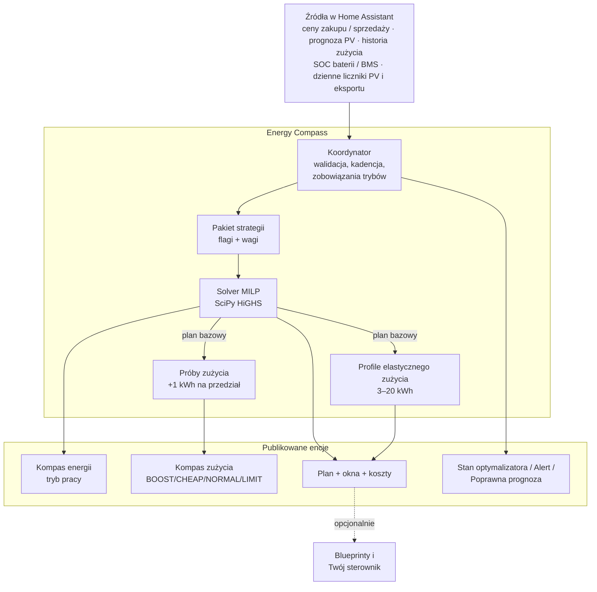

Każde obliczenie przebiega tak:

1. **Migawka i walidacja wejść.** Ceny, prognoza PV, prognoza zużycia (z historii recordera), SOC
   baterii i liczniki dzienne są odczytywane i sprawdzane pod kątem świeżości, jednostek i
   wiarygodności.
2. **Budowa problemu.** Natywne sloty taryfowe (zwykle 15 min) w horyzoncie planowania (domyślnie
   24 h), limity sprzętu, granice SOC, przeniesione zobowiązanie trybu pracy i aktywny pakiet
   **strategii**.
3. **Rozwiązanie planu bazowego.** Mieszany program liniowy minimalizuje koszt (plus wagi
   strategii) przy ograniczeniach bilansu energii, baterii, sieci, minimalnego czasu trybu i
   polityk eksportu/ładowania. Publikowane jest wyłącznie udowodnione optimum.
4. **Próby zużycia.** Dla każdego przedziału wyświetlania solver liczy plan jeszcze raz z
   dodatkowym 1 kWh obciążenia; różnica kosztu to *koszt krańcowy jednej kWh więcej*, klasyfikowany
   na poziom zużycia.
5. **Profile elastycznego zużycia.** Osobne rozwiązania dla bloków 3, 5, 10, 15 i 20 kWh mierzą, ile
   elastycznej energii można zaplanować, zanim cena się pogorszy.
6. **Publikacja.** Jedna spójna generacja aktualizuje wszystkie encje; niezmienione encje nie są
   zapisywane ponownie.

### Kadencja przeliczeń

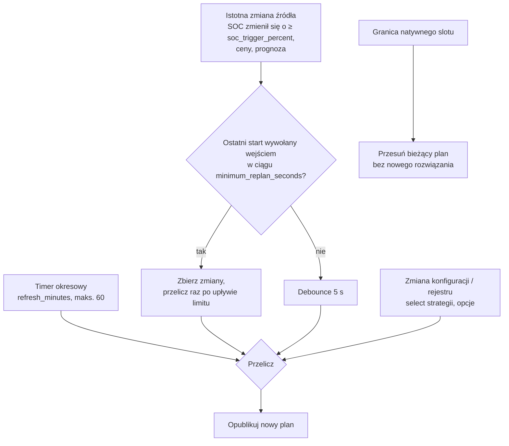

- **Okresowo:** `refresh_minutes` (domyślnie 15, maks. 60), wyrównane do zegara.
- **Na zmianę wejść:** najwyżej raz na `minimum_replan_seconds` (domyślnie 900 s, `0` wyłącza),
  dopóki istnieje ważny plan; SOC liczy się jako zmieniony dopiero po przesunięciu o
  `soc_trigger_percent` (domyślnie 5 %) od wartości, która uruchomiła ostatnie obliczenie.
- **Granice slotów:** na każdej natywnej granicy rozliczeniowej istniejący plan przesuwa się
  (zużyte wiersze znikają, zegary trybów biegną) bez uruchamiania solvera.
- **Ważność planu:** nowy plan jest ważny do `generated_at + 2 × refresh_minutes`, nie dłużej niż
  pokrycie prognozy.

## Przegląd encji

`<name>` to tytuł wpisu integracji.

| Encja | Nazwa EN | Nazwa PL | Stan |
| --- | --- | --- | --- |
| `sensor.<name>_consumption_compass` | Consumption compass | Kompas zużycia | `BOOST` / `CHEAP` / `NORMAL` / `LIMIT` |
| `sensor.<name>_consumption_cost` | Consumption cost | Koszt zużycia | waluta/kWh za jedną kWh więcej teraz |
| `sensor.<name>_flexible_energy_depth` | Flexible energy depth | Głębokość elastycznego zużycia | kWh |
| `sensor.<name>_next_change` | Next change | Następna zmiana | znacznik czasu następnej zmiany poziomu |
| `sensor.<name>_next_boost_start` | Next boost start | Początek zwiększonego zużycia | znacznik czasu |
| `sensor.<name>_next_cheap_start` | Next cheap start | Początek taniego okresu | znacznik czasu |
| `sensor.<name>_next_limit_start` | Next limit start | Początek ograniczenia | znacznik czasu |
| `sensor.<name>_energy_compass` | Energy compass | Kompas energii | jeden z sześciu trybów pracy |
| `sensor.<name>_plan` | Plan | Plan | czas generacji + pełne atrybuty planu |
| `sensor.<name>_expected_net_cost` | Expected net cost | Przewidywany koszt netto | waluta w horyzoncie |
| `sensor.<name>_expected_wear_cost` | Expected wear cost | Przewidywany koszt zużycia baterii | waluta w horyzoncie |
| `sensor.<name>_optimizer_status` | Optimizer status | Stan optymalizatora | stan obliczeń (diagnostyczny) |
| `sensor.<name>_battery_balance` | Battery balance | Balansowanie baterii | `ok` / `eligible` / `scheduled` / `holding` / `overdue` (diagnostyczny) |
| `binary_sensor.<name>_forecast_valid` | Forecast valid | Poprawna prognoza | `on` / `off` |
| `binary_sensor.<name>_alert` | Alert | Alert | `on` / `off` (diagnostyczny, problem) |
| `select.<name>_strategy` | Strategy | Strategia | jedna z sześciu strategii |

Sensory kosztów można wyłączyć opcją **Prezentacja → Włącz encje kosztów**, znaczniki okien —
**Włącz encje okresów**, a głębokość elastycznego zużycia — **Prognoza kosztu zużycia → Włącz
głębokość elastycznego zużycia**. Balansowanie baterii jest domyślnie wyłączone i włącza się je
ustawieniem **LFP balance**; jego atrybuty to `last_completed`, `next_due`, `days_overdue`,
`planned_start`, `planned_end`, `planned_mode`, `hold_progress_minutes`, `hold_required_minutes`
i `threshold_percent`.

### Reguła dostępności

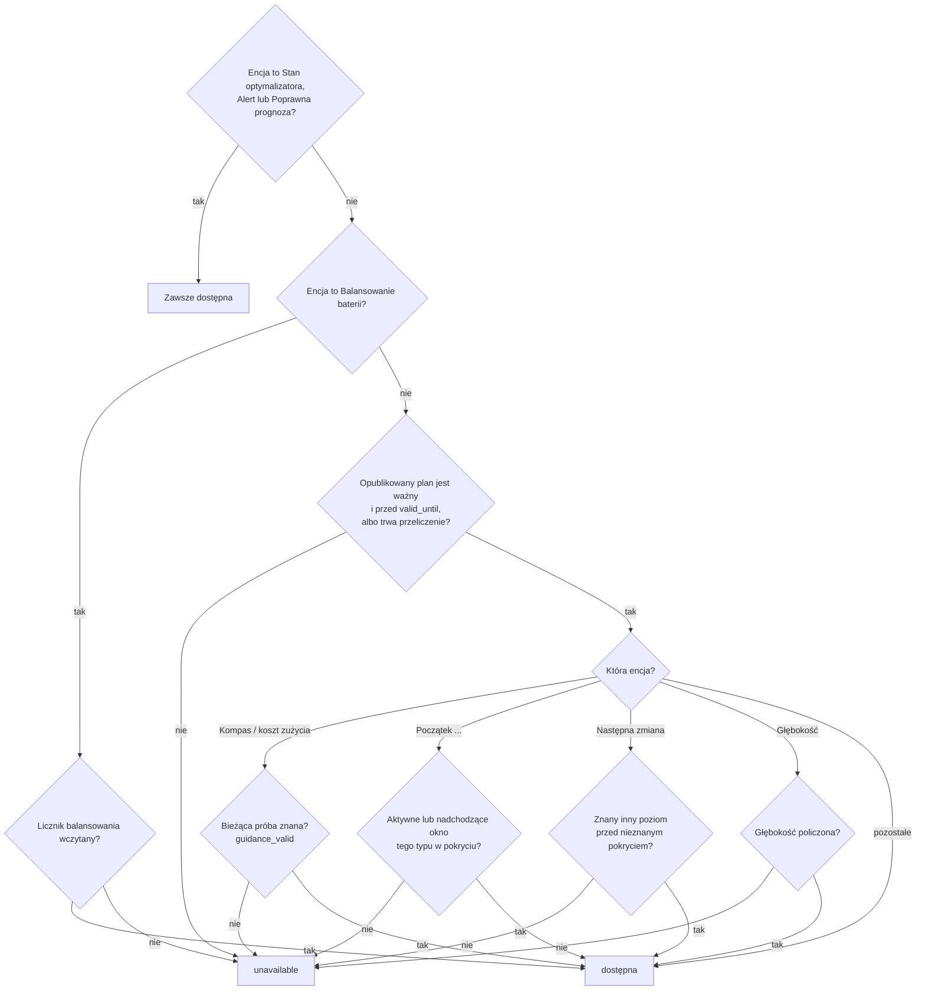

## Stan optymalizatora — cykl obliczeń

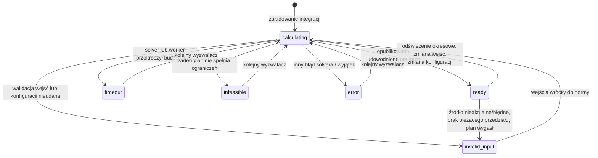

| Stan | Etykieta EN / PL | Kiedy występuje | Co pozostaje opublikowane |
| --- | --- | --- | --- |
| `ready` | Ready / Gotowy | Ostatnie obliczenie dało udowodnione optimum planu bazowego i zostało opublikowane. | Nowy plan. `ready` nie gwarantuje pełnego pokrycia odniesienia — sprawdź `reason`. |
| `calculating` | Calculating / Obliczanie | Obliczenie czeka w kolejce lub trwa. `reason` mówi dlaczego: `inputs_changed` (zmiana wejść), `interval_boundary` (termin odświeżenia okresowego), `inputs_recovered` (wejścia wróciły), `calculating` (worker wystartował), `soc_rebase_pending` (skok SOC w górę czeka na potwierdzenie). | Poprzedni plan, dopóki pokrywa bieżący czas, z `refreshing: true`. Istniejący alert pozostaje włączony. |
| `invalid_input` | Invalid input / Niepoprawne dane | Brak wymaganego źródła, `unavailable`, dane nieaktualne, zła jednostka, wartość poza zakresem, SOC niezgodny z BMS lub skok SOC, liczniki dzienne z poprzedniego dnia, błędne ustawienia; także `no_current_interval` i `expired_inputs`, gdy zachowany plan już nie pokrywa bieżącego czasu. | Poprzedni plan, dopóki pokrywa bieżący czas (`plan_retained: true`); w przeciwnym razie nic. |
| `timeout` | Timeout / Przekroczony czas | Rozwiązanie bazowe przekroczyło `solve_time_limit_s` (domyślnie 10 s) albo worker przekroczył `total_time_limit_s + 1` (powód `worker_deadline`). | Poprzedni plan w jego pokryciu. |
| `infeasible` | Infeasible / Brak rozwiązania | Solver udowodnił, że żaden plan nie spełnia wszystkich twardych ograniczeń (np. rezerwa SOC, reguła końcowa, przeniesione zobowiązanie trybu, deficyt Sell only PV, limity sieci). | Poprzedni plan w jego pokryciu. |
| `error` | Error / Błąd | Każdy inny błąd solvera lub nieoczekiwany wyjątek; `reason` zawiera powód solvera lub klasę wyjątku. | Poprzedni plan w jego pokryciu. |
| `insufficient_data` | Insufficient data / Za mało danych | Zarezerwowany w tłumaczeniach; **nie jest emitowany** przez obecny koordynator — brak danych daje `invalid_input`. | — |

Atrybuty: `last_calculation_started_at`, `calculations_since_load`,
`expired_previous_generated_at`. Diagnostyka dodaje `calculations_last_hour` i
`calculations_last_24h`.

### Wyniki wyprzedzone

Jeśli wejścia zmienią się w trakcie obliczeń, gotowy wynik i tak zostanie opublikowany, gdy
zmieniły się tylko wejścia (nie konfiguracja) — jest świeższy niż zachowany plan — a potem rusza
nowe obliczenie. Zmiany konfiguracji, rejestru i błędne wejścia odrzucają wynik w toku.

## Alert i poprawność prognozy

### Poprawna prognoza (`binary_sensor.<name>_forecast_valid`)

| Stan | Warunek |
| --- | --- |
| `on` | Istnieje opublikowany plan i `now < valid_until`. Obowiązuje także w trakcie ponownych prób i gdy zachowany plan wciąż pokrywa bieżący czas. |
| `off` | Brak planu albo skończyło się jego pokrycie/ważność. Rekomendacje stają się niedostępne. |

Atrybut `current_guidance_valid` ma wartość `true` tylko wtedy, gdy próba zużycia dla bieżącego
przedziału dała znany poziom. Pozostałe atrybuty: `coverage_end`, `requested_end`,
`coverage_complete`, `input_ages`, `missing_sources`, `load_quality`.

### Alert (`binary_sensor.<name>_alert`)

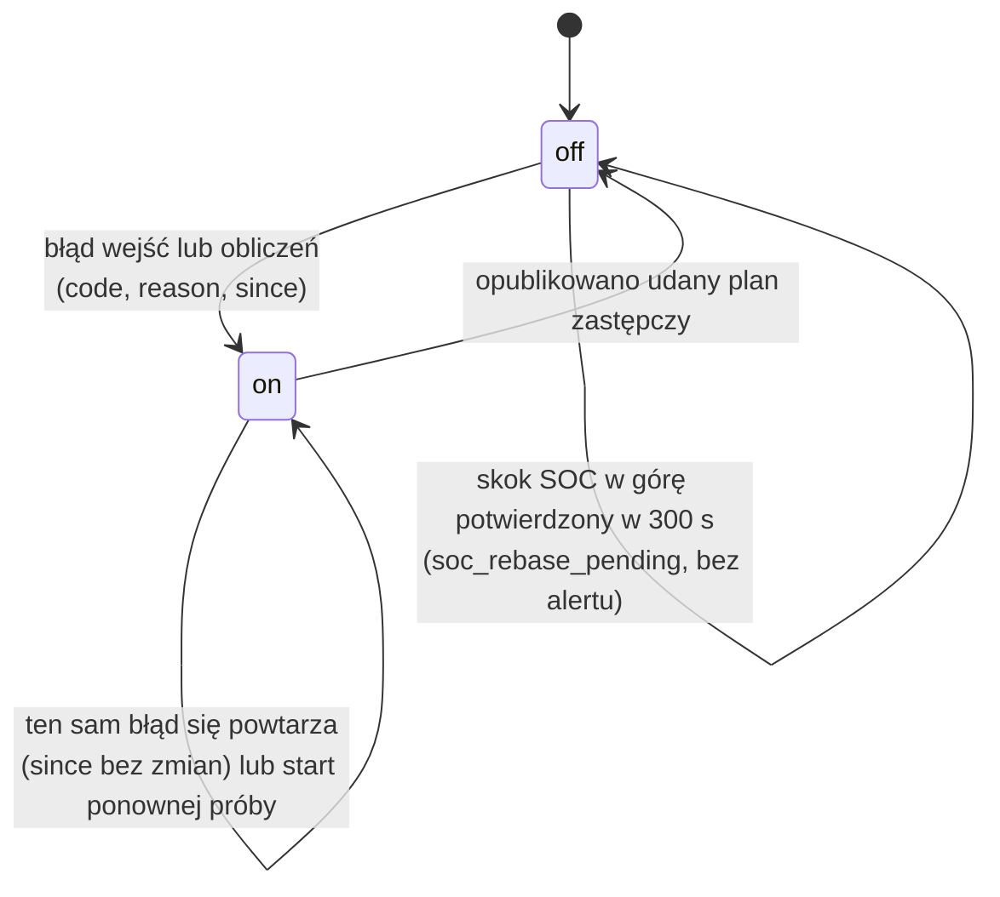

| `code` | EN / PL | Warunek |
| --- | --- | --- |
| `invalid_input` | Invalid input / Nieprawidłowe dane wejściowe | Dowolny błąd walidacji wejść (patrz stan optymalizatora). |
| `soc_measurement_jump` | SOC measurement jump / Skok wskazania SOC | Między dwoma odczytami SOC zmienił się o więcej niż moc baterii × upływ czasu + `soc_jump_percent` (domyślnie 2 %) pojemności. Skok w dół — alert od razu; skok w górę (rekalibracja BMS przy pełnej baterii) najpierw daje `calculating`/`soc_rebase_pending`, a alert tylko gdy nie zostanie potwierdzony w 300 s. Wyjście z alertu wymaga świeżych, wiarygodnych odczytów obejmujących ≥ 60 s. |
| `timeout` | Calculation timeout / Przekroczony czas obliczeń | Przekroczony limit solvera lub workera. |
| `infeasible` | No feasible plan / Brak wykonalnego planu | Żaden plan nie spełnia twardych ograniczeń. |
| `error` | Calculation error / Błąd obliczeń | Inny błąd. |

Atrybuty: `code`, `reason`, `since`, `plan_retained`, `last_successful_plan_at`. Ponowna próba
nie gasi alertu; gasi go dopiero udany nowy plan.

### Zachowanie planu

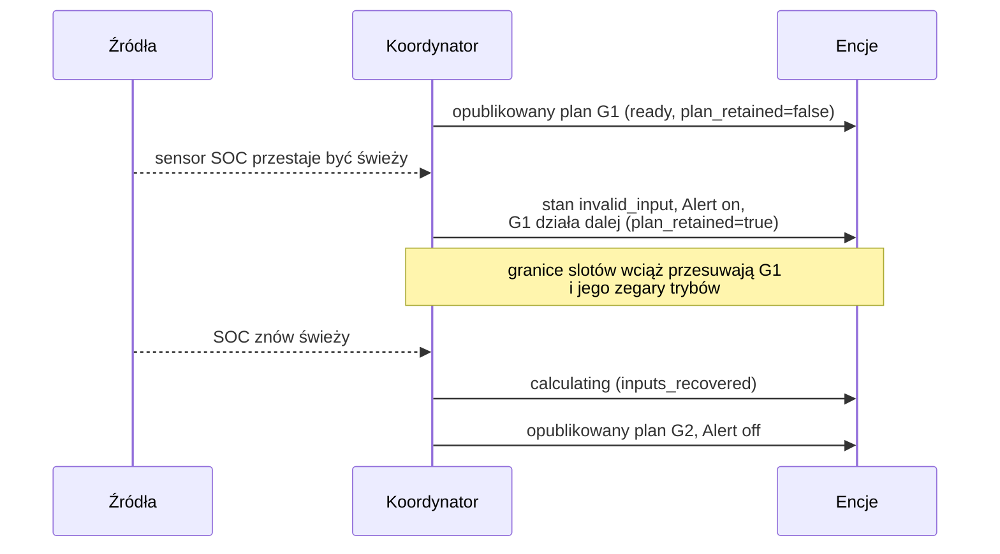

Zachowany plan nigdy nie jest wydłużany poza pierwotne pokrycie i nie przetrwa przeładowania
integracji ani restartu Home Assistant.

## Tryby pracy — planowany stan baterii

Sensor **Kompas energii** pokazuje tryb pracy bieżącego przedziału; każdy wiersz atrybutu
`intervals` planu ma pole `dispatch_mode`. Trybów jest sześć. Dla przedziału o długości `h` godzin:
`activity = minimum_mode_power_kw × h` (domyślnie 0,1 kW) oraz `surplus = max(PV − zużycie, 0)`.

| Tryb | Znaczenie | Występuje, gdy (przepływy fizyczne) | Dozwolony tylko jeśli |
| --- | --- | --- | --- |
| `CHARGE_GRID` | Ładowanie z sieci | Ładowanie ≥ nadwyżka PV + activity — ładuje się więcej, niż daje nadwyżka PV, więc baterię zasila sieć. Bez rozładowania i ograniczania PV. | `allow_grid_charge` włączone; cena ≤ sufit ceny ładowania z sieci, gdy ten limit jest włączony. |
| `CHARGE_PV` | Ładowanie z PV | activity ≤ ładowanie ≤ nadwyżka — ładuje tylko nadwyżka słoneczna. Bez rozładowania i ograniczania PV. | Jest nadwyżka PV. |
| `DISCHARGE_GRID` | Rozładowanie z eksportem | Rozładowanie ≥ activity **i** eksport do sieci ≥ activity — bateria sprzedaje energię. | `allow_battery_export` włączone; moc eksportu > 0; pozwala na to budżet Sell only PV i próg korzyści eksportu. |
| `SELF_CONSUME` | Autokonsumpcja | Rozładowanie ≥ activity, bez ładowania, eksportu i ograniczania — bateria zasila dom. | SOC powyżej rezerwy operacyjnej. |
| `HOLD` | Wstrzymanie | Brak ładowania, rozładowania i ograniczania — bateria stoi; dom zasila sieć/PV. | Zawsze dostępny. |
| `CURTAIL` | Ograniczanie PV | Ograniczenie produkcji ≥ activity, bateria nieaktywna. | `allow_curtailment` włączone. |

Przy wyłączonym minimalnym czasie trybu (`minimum_mode_minutes = 0`) stan wyświetlany wynika z
przepływów wg pierwszeństwa: CURTAIL → CHARGE_GRID → CHARGE_PV → DISCHARGE_GRID → SELF_CONSUME →
HOLD.

Zaplanowane [trzymanie balansu LFP](#balansowanie-lfp) nie dodaje osobnego trybu: jego wiersze
korzystają z `CHARGE_PV` lub `CHARGE_GRID` i mają `balance_hold: true` w atrybucie `intervals`
planu.

### Przejścia i minimalny czas trwania

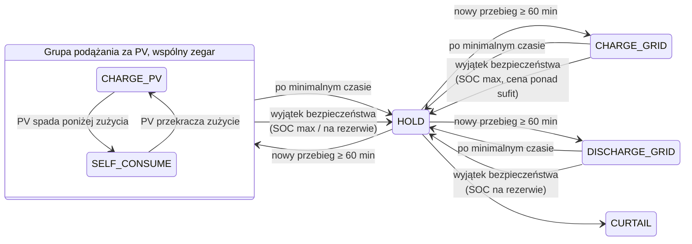

Diagram jest uproszczony — HOLD pokazano jako węzeł centralny: po minimalnym czasie każdy tryb może
przejść bezpośrednio w dowolny inny dostępny tryb.

Zasady (domyślnie 60 min, 0,1 kW):

- **Każdy nowo rozpoczęty tryb — także HOLD i CURTAIL — trwa co najmniej
  `minimum_mode_minutes`.** Tylko końcowy pasywny przebieg HOLD/CURTAIL może być przycięty przez
  pokrycie prognozy. Koordynator zapisuje
  przyjęty tryb i jego start; przeliczenie i restart zachowują zegar.
- **Grupa podążania za PV:** `CHARGE_PV` i `SELF_CONSUME` dzielą jeden zegar — w obu falownik
  ładuje z nadwyżki i pokrywa deficyt z baterii, więc przełączanie między nimi nie jest zmianą
  trybu.
- **Każda inna zmiana** (źródło, cel, HOLD lub CURTAIL) uruchamia nowy zegar. Bezczynny HOLD nie
  „odlicza” czasu dla aktywnego przebiegu.
- **Pokrycie:** nowy aktywny tryb wymaga pełnego minimalnego czasu pokrycia prognozą.
- **Wyjątek bezpieczeństwa (pauza, nie reset):** w trakcie niewygasłego aktywnego zobowiązania
  bieżący wiersz pokazuje HOLD, gdy obserwowany SOC jest już na górnej granicy (tryby ładowania —
  `observed_soc_maximum`) lub na/poniżej rezerwy (tryby rozładowania — `observed_soc_minimum`),
  albo gdy przeniesione `CHARGE_GRID` trafia przed terminem na cenę powyżej sufitu
  (`grid_charge_price_limit`). Przerwany tryb i termin pozostają zapisane; przed tym terminem nie
  może wystartować żaden inny tryb. Widoczne w `dispatch_policy.safety_exception`.
- **Zmiana strategii (reset):** zapis nowej strategii zrywa przeniesione zobowiązanie dla
  następnego planu, który startuje bez blokady (patrz [zwolnienie przy zmianie
  strategii](#zwolnienie-przy-zmianie-strategii)).
- `minimum_mode_minutes = 0` wyłącza reguły czasu i minimalnej mocy.

### Polityki ograniczające tryby

| Polityka | Domyślnie | Efekt |
| --- | --- | --- |
| **Sell only PV** (`limit_export_to_pv`, „sprzedawaj tylko PV”) | włączona | W każdej dobie lokalnej: eksport ≤ produkcja PV (zaobserwowana od północy + prognoza). Wymaga liczników `pv_energy_today` i `grid_export_energy_today`. |
| **Limit ceny ładowania z sieci** (`limit_grid_charge_price`, `maximum_grid_charge_price`) | wyłączony | CHARGE_GRID tylko przy cenie zakupu ≤ sufit przez cały minimalny czas trybu. |
| **Minimalna korzyść eksportu** (`minimum_export_episode_benefit`) | 1 jednostka waluty | Każdy dodatkowy okres eksportu z baterii musi poprawić koszt całego horyzontu co najmniej o tę kwotę. `0` wyłącza. |
| **Minimalna korzyść epizodu ładowania z sieci** (`minimum_grid_charge_episode_benefit`) | 0 (wył.) | Ten sam próg dla nowych okresów ładowania z sieci; skupia ładowanie w mniej epizodów. |
| **Kara za import** (`import_penalty_per_kwh`) | 0 | Planistyczna cena cienia za każdą importowaną kWh, w każdej strategii. |
| **Pobór czuwania falownika** (`idle_drain_kw`) | 0 (wył.) | Stały ubytek energii baterii modelowany w każdym przedziale. |
| **Reguła końcowa** (`terminal_mode`) | `preserve_initial` | SOC na końcu ≥ SOC na starcie, albo `value`: energia na końcu wyceniana po `terminal_value_per_kwh`. |

## Poziomy zużycia — BOOST, CHEAP, NORMAL, LIMIT

**Kompas zużycia** odpowiada na pytanie: „jak opłacalne jest zużycie jednej kWh więcej w tym
przedziale?”. Dla każdego przedziału wyświetlania (domyślnie 60 min w horyzoncie 24 h) solver
liczy plan z dodatkowym obciążeniem `probe_kwh` (domyślnie 1 kWh). **Koszt zużycia** = (koszt planu
z próbą − koszt planu bazowego) ÷ dodana energia. Bateria i sieć są przy tym optymalizowane od
nowa, więc to prawdziwy koszt krańcowy — może różnić się od ceny taryfowej (np. energia z PV,
którą inaczej by sprzedano, kosztuje utraconą wartość eksportu).

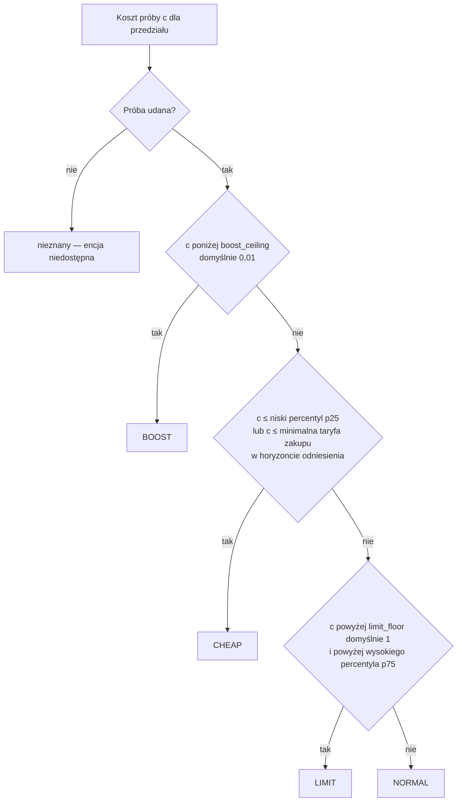

| Poziom | EN / PL | Warunek | Typowa sytuacja |
| --- | --- | --- | --- |
| `BOOST` | Boost / Zwiększone zużycie | Koszt ściśle poniżej `boost_ceiling` (domyślnie 0,01 waluty/kWh). | Energia darmowa lub ujemna: nadwyżka PV, której nie da się zmagazynować ani sprzedać, ujemne ceny. Włączaj, co się da. |
| `CHEAP` | Cheap / Tanio | Nie BOOST, a koszt ≤ `cheap_percentile` (domyślnie 25.) kosztów odniesienia **lub** ≤ minimalna taryfa zakupu w horyzoncie odniesienia. | Jedne z najtańszych godzin okna odniesienia. Dobry czas na odbiorniki elastyczne. |
| `LIMIT` | Limit / Ograniczenie | Koszt ściśle powyżej zarówno `limit_floor` (domyślnie 1 waluty/kWh), jak i `limit_percentile` (domyślnie 75.). | Drogi szczyt — dodatkowe zużycie wymusza drogi import albo traci cenny eksport. Odłóż. |
| `NORMAL` | Normal / Normalnie | Wszystko pozostałe. | Warunki przeciętne. |
| nieznany | — | Próba nieudana lub zabrakło czasu, albo przedział jest poza pokryciem prognozy. | Encja niedostępna; późniejsze okna mogą być znane. |

Percentyle liczone są z udanych prób w całym horyzoncie odniesienia (domyślnie 24 h) z interpolacją
liniową. Gdy nie powiedzie się pełna próba odniesienia, decyduje `short_coverage`:
`absolute_fallback` (domyślnie: zostają bezwzględne reguły BOOST/LIMIT i reguła CHEAP wg minimalnej
taryfy) albo `unavailable`.

## Okna i głębokość elastycznego zużycia

### Okna

Sąsiednie przedziały tego samego poziomu łączą się w okna. `next_boost_start`, `next_cheap_start`
i `next_limit_start` pokazują początek aktywnego lub następnego okna danego typu; `next_change` —
następny znany, inny poziom.

| Atrybut `status` | Warunek |
| --- | --- |
| `active` | Początek okna ≤ teraz < koniec. |
| `upcoming` | Okno zaczyna się później, w pokryciu prognozy. |
| `none_in_coverage` | Brak takiego okna w prognozie; encja niedostępna. |

`start_basis` ma wartość `forecast` albo `first_observed`, gdy już aktywne okno zachowuje pierwszy
zaobserwowany początek mimo przeliczeń i restartów. `next_change` zatrzymuje się na nieznanym
pokryciu zamiast zgadywać.

### Głębokość elastycznego zużycia

Odpowiada na pytanie: „ile energii odkładalnej mogę tanio zużyć?”. Solver niezależnie rozmieszcza
bloki 3, 5, 10, 15 i 20 kWh z mocą do `flexible_load_max_power_kw` (domyślnie 3 kW).

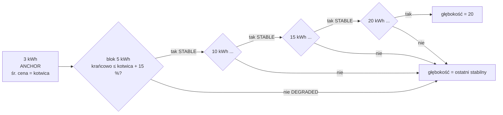

| Status profilu | Warunek |
| --- | --- |
| `ANCHOR` | Profil 3 kWh; jego średni koszt krańcowy to cena kotwicy. |
| `STABLE` | Krańcowy koszt bloku ≤ kotwica + `flexible_price_degradation_percent` (domyślnie 15 %) z \|kotwicy\|. |
| `DEGRADED` | Krańcowy koszt bloku powyżej progu — zatrzymuje publikowaną głębokość. |
| `UNKNOWN` | Nie policzono: `insufficient_time` (blok nie zmieści się przy maks. mocy w horyzoncie), `timeout` lub powód solvera. Zatrzymuje głębokość. |

Grupy: `small` (3/5 kWh), `medium` (10/15 kWh), `large` (20 kWh).

## Strategie dyspozycji

`select.<name>_strategy` wybiera pakiet funkcji celu, którego używa solver. Każda strategia
zachowuje wszystkie twarde ograniczenia fizyczne; strategie zmieniają wyłącznie **wagi
planistyczne** i niewielki zestaw **flag polityk**. Raportowane koszty (`expected_net_cost`, koszt
zużycia) zawsze są w prawdziwej walucie — kary strategii nigdy się w nich nie pojawiają.

| Strategia | Etykieta EN / PL | Cel | Typowe użycie |
| --- | --- | --- | --- |
| `cost_min` | Cost minimisation / Minimalizacja kosztów | Najniższy koszt całkowity | Domyślna, na co dzień |
| `self_sufficiency` | Self-sufficiency / Samowystarczalność | Najmniej kWh z sieci | Płaskie ceny, preferencja niezależności, ceny zerowe/ujemne |
| `backup_ready` | Backup ready / Gotowość awaryjna | Duża rezerwa w baterii | Ostrzeżenie burzowe, planowana przerwa, zima |
| `pv_swap` | PV swap / Zamiana energii PV | Kup tanio w nocy, sprzedaj własne PV później | Mała zimowa produkcja PV i wyższa cena wieczorem |
| `max_export` | Maximum export / Maksymalny eksport | Arbitraż bez ograniczeń | Okna wysokich cen sprzedaży |
| `grid_friendly` | Grid friendly / Przyjazna dla sieci | Spłaszczenie szczytów importu/eksportu | Taryfy mocowe, słabe przyłącze |

### Co zmienia każda strategia

Solver minimalizuje

```text
grid     = Σ ( import_weight × buy × import + import_kwh_weight × import
               − export_weight × (sell − pv_export_margin) × export )
           + battery_export_penalty_per_kwh × battery_export
autonomy = soc_target_weight × Σ (najgłębszy niedobór w oknie poniżej progu autonomii)
peak     = peak_import_weight × max(moc importu)
caps     = cap_violation_weight × Σ (import/eksport ponad miękkie limity)
objective = grid + wear + progi epizodów + autonomy + peak + caps − terminal credit
```

| Strategia | Próg autonomii | Sprzedawaj tylko PV | Sufit ceny ładowania z sieci | Próg korzyści eksportu | Wagi |
| --- | --- | --- | --- | --- | --- |
| `cost_min` | wył. | ustawienie użytkownika | ustawienie użytkownika | ustawienie użytkownika | domyślne (tylko `import_penalty_per_kwh`) |
| `self_sufficiency` | **wł.** | ustawienie użytkownika | ustawienie użytkownika | ustawienie użytkownika | `import_kwh_weight` = max(5,0; max \|cena zakupu\| + 0,50; kara za import); kara za eksport z baterii 0,20/kWh |
| `backup_ready` | **wł.**, próg ≥ 80 % pojemności | ustawienie użytkownika | ustawienie użytkownika | ustawienie użytkownika | waga progu ≥ 2,0/kWh |
| `pv_swap` | **wł.** | **wymuszone wł.** | **wymuszone wył.** | ustawienie użytkownika | cena sprzedaży obniżona o marżę 0,05/kWh |
| `max_export` | **wył.** | **wymuszone wył.** | **wymuszone wył.** | **wymuszone 0** | domyślne |
| `grid_friendly` | **wył.** | ustawienie użytkownika | ustawienie użytkownika | ustawienie użytkownika | szczyt importu 0,50/kW, przekroczenie miękkiego limitu 2,0/kWh |

„Ustawienie użytkownika” oznacza, że strategia zostawia opcję tak, jak ją skonfigurowano.
Wartości **wymuszone** działają tylko dla opcji, których użytkownik nie ustawił jawnie: każda
opcja należąca do strategii, która różni się od wartości fabrycznej, trafia do
`explicit_strategy_fields` i pakiet nigdy jej nie nadpisuje.

Wszystkie liczby powyżej to domyślne wartości opcji Planowania:
`self_sufficiency_import_price_per_kwh` (5,0), `self_sufficiency_export_penalty_per_kwh` (0,20),
`backup_target_soc_percent` (80), `backup_shortfall_price_per_kwh` (2,0),
`pv_swap_margin_per_kwh` (0,05), `peak_import_price_per_kw` (0,50),
`cap_violation_price_per_kwh` (2,0), `grid_friendly_import_cap_kw` / `_export_cap_kw` (0 = limit
przyłącza), `autonomy_margin_per_kwh` (0,10).

### Próg autonomii (używany przez `self_sufficiency`, `backup_ready`, `pv_swap`)

Próg pyta: *czy bateria przeprowadzi dom przez następny okres, w którym zużycie przewyższa PV?*
Horyzont dzielony jest na okna wg skumulowanej nadwyżki netto; w każdym oknie cel wynosi

```text
soc_target[t] = min(pojemność użyteczna, rezerwa + (1 / η_rozładowania) × Σ deficytu do końca okna)
```

Najgłębszy niedobór poniżej celu jest liczony **raz na okno** z wagą `soc_target_weight` =
oczekiwana cena nocnego odkupu (mediana nocnych cen zakupu) + `autonomy_margin_per_kwh`. Próg
patrzy 48 h do przodu na prognozy PV/zużycia, nawet zanim zostaną opublikowane jutrzejsze ceny.
Jest **miękki**: naruszenie trafia do `autonomy_shortfall_kwh` planu zamiast dawać brak rozwiązania.
Wymaga źródła PV (inaczej `autonomy_floor_requires_pv`).

### Balansowanie LFP

Pakiety LFP potrzebują okresowego pełnego naładowania i krótkiego przetrzymania na górze, aby BMS
mógł zbalansować cele i ponownie wyzerować odczyt SOC. Przy włączonej opcji **Okresowe
balansowanie LFP** (`lfp_balance`) Energy Compass śledzi ostatnio zakończony balans i planuje
następny. Sam licznik dalej obserwuje SOC i przesuwa swój stan nawet przy wyłączonym
`lfp_balance` — ustawienie włącza tylko publikowanie okien balansu i encji diagnostycznej.

| Ustawienie | Domyślnie | Znaczenie |
| --- | --- | --- |
| `balance_interval_days` | 7 | Dni między zakończonymi balansami |
| `balance_hold_minutes` | 60 | Minuty, które SOC musi utrzymać na/ponad progiem |
| `balance_soc_threshold` | 99 % | SOC uznawany za pełny |
| `balance_value` | 5,0 | Wartość zbalansowania w dniu terminu |

Balans **kończy się**, gdy SOC utrzymuje się na/ponad progiem przez cały czas trzymania. Odczyt
poniżej progu resetuje trzymanie. Liczy się tylko zaobserwowany czas: niedostępny lub nieaktualny
SOC nie daje zaliczenia, a dwa pełne odczyty odległe o więcej niż `soc_max_age_seconds` zaczynają
trzymanie od nowa od późniejszego z nich (trzymanie, którego ostatni pełny odczyt jest starszy,
nie trwa ani się nie kończy). Zakończenie jest oceniane leniwie — dopóki napływają pełne odczyty,
trzymanie kończy się przy najbliższym sprawdzeniu, bez potrzeby zmiany stanu. Fazy: `ok` →
`eligible` (wcześniejsze z: 2 dni lub pół odstępu przed terminem) → `due`; `holding` nakłada się
na aktywną fazę podczas trwania trzymania. Trzymanie, które zaczyna się, gdy balans jest jeszcze
w fazie `ok` (np. SOC znów 100 % dzień po balansie), jest śledzone i się kończy, ale nie jest
planowane: optymalizator nie dostaje dla niego okna ani kosztu pominięcia.

Optymalizator może wybrać jedno okno trzymania wyrównane do pełnej godziny: kandydujące okna
zaczynają się tylko o pełnej godzinie, a w fazie `due` — tylko w ciągu następnych 24 h (faza
`eligible` może szukać w całym horyzoncie). W wybranym oknie SOC utrzymuje się na/ponad progiem, a
bateria się nie rozładowuje. Pominięcie kosztuje 10 % `balance_value` w fazie eligible — mało,
więc planista zwykle balansuje tylko na taniej lub darmowej energii, ale wybierze okno z siecią,
jeśli kosztuje mniej — `balance_value × (1 + dni po terminie)` w fazie due i 10 × `balance_value`
podczas trzymania w fazie eligible lub due. Okno jest publikowane jako **CHARGE_PV** tylko wtedy,
gdy PV pokrywa zużycie w każdym jego przedziale; w przeciwnym razie (okno mieszane PV/sieć albo
czysto sieciowe, np. nocne) jako **CHARGE_GRID**, co dodatkowo wymaga, aby ładowanie z sieci było
dozwolone i (jeśli włączony) sufit ceny ładowania z sieci był zachowany w każdym przedziale — z
`balance_hold: true` w każdym wierszu. Od przedziału przed najwcześniejszym
kandydującym oknem do końca horyzontu energia baterii może wzrosnąć aż do pełnej pojemności, a nie
tylko do skonfigurowanego sufitu SOC, więc trzymanie nie jest blokowane przez `soc_ceiling` poniżej
100 % — to podniesienie ma znaczenie tylko wtedy, gdy sufit jest poniżej 100 %. Próby zużycia
utrzymują wybrane okno bez zmian, aby dodatkowe obciążenie wyceniało zużycie, a nie wybór balansu.

Diagnostyczny sensor **Balansowanie baterii** (`sensor.<name>_battery_balance`) zgłasza `ok`,
`eligible`, `scheduled`, `holding` lub `overdue`, z atrybutami `last_completed`, `next_due`,
`days_overdue`, `planned_start`, `planned_end`, `planned_mode`, `hold_progress_minutes`,
`hold_required_minutes`, `threshold_percent`.

### `cost_min` — minimalizacja kosztów

- **Cel:** najniższy prognozowany koszt: zakupy − sprzedaż + zużycie baterii − wartość końcowa.
- **Zmiany:** żadne; bajt w bajt ten sam model co bazowy, gdy `import_penalty_per_kwh = 0`.
- **Zachowanie:** ładuje, gdy energia jest tania (z sieci lub PV), rozładowuje w drogich godzinach,
  eksportuje tylko gdy różnica cen pokrywa straty, zużycie baterii i próg korzyści eksportu.
- **Wybierz, gdy:** normalna praca na co dzień; to strategia domyślna i awaryjna w blueprincie.
- **Uwaga:** bez rezerwy autonomii może zostawić baterię nisko przed pozornie tanią nocą, jeśli
  prognoza się myli.

### `self_sufficiency` — samowystarczalność

- **Cel:** minimalizacja **kWh z sieci**, nie pieniędzy.
- **Zmiany:** każda importowana kWh kosztuje co najmniej `max(5,0; najwyższa |cena zakupu| + 0,50;
  import_penalty_per_kwh)`, więc import zawsze dominuje nad różnicami cen; eksport z baterii
  kosztuje dodatkowo 0,20/kWh; próg autonomii włączony.
- **Zachowanie:** ładuje baterię z PV, unika ładowania z sieci i eksportu z baterii, trzyma energię
  na następne okno deficytu.
- **Wybierz, gdy:** różnica cen dzień/noc jest mała (blueprint wybiera ją przy różnicy poniżej
  0,15 PLN/kWh), ceny są zerowe lub ujemne, albo niezależność jest ważniejsza niż koszt.
- **Uwaga:** raportowane koszty są prawdziwe — ta strategia może kosztować więcej niż `cost_min`.

### `backup_ready` — gotowość awaryjna

- **Cel:** utrzymać dużą rezerwę na wypadek awarii sieci.
- **Zmiany:** próg autonomii włączony i podniesiony do co najmniej `backup_target_soc_percent`
  (80 %) pojemności; jego waga wynosi co najmniej `backup_shortfall_price_per_kwh` (2,0/kWh).
- **Zachowanie:** doładowuje do ok. 80 % i nie schodzi niżej, chyba że niedobór jest wart więcej
  niż 2,0/kWh; próg jest miękki, więc plan zawsze istnieje.
- **Wybierz, gdy:** ostrzeżenia burzowe lub o przerwach w dostawie, planowane prace, mroźne noce.
  Reguła `alert` blueprintu wybiera ją, gdy Twoja encja alertu jest włączona.
- **Uwaga:** połączenie z niskim sufitem ceny ładowania z sieci daje ostrzeżenie
  `grid_charge_ceiling_below_autonomy_weight` — próg mógłby zostać opróżniony, ale nigdy
  uzupełniony.

### `pv_swap` — zamiana energii PV

- **Cel:** w sezonie niskiej produkcji kupić tanio w nocy i sprzedać rzeczywistą dzienną produkcję
  PV później, po wyższej cenie.
- **Zmiany:** od każdej ceny sprzedaży odejmowana jest marża `pv_export_margin` (0,05/kWh) — eksport
  musi pobić nocny zakup co najmniej o nią; **Sell only PV wymuszone** (dzienny eksport ≤
  dzienna produkcja PV); **sufit ceny ładowania z sieci wymuszony wył.** (nocne ładowanie nie
  jest blokowane); próg autonomii włączony.
- **Zachowanie:** ładuje z sieci w nocy, dzienne PV pokrywa dom, wieczorem w szczycie eksportuje do
  wysokości dziennej produkcji PV.
- **Wybierz, gdy:** jutrzejsza prognoza PV jest mniejsza niż dzienne zużycie i `wieczorna cena
  sprzedaży × sprawność cyklu ≥ nocna cena zakupu + marża` (reguła `pv_swap` blueprintu).
- **Uwaga:** Sell only PV liczy energię, nie jej pochodzenie — eksport z baterii jest
  ograniczony łącznie do dziennej produkcji PV, bez śledzenia źródła.

### `max_export` — maksymalny eksport

- **Cel:** czysty arbitraż, maksymalny przychód z eksportu.
- **Zmiany:** **próg korzyści eksportu wymuszony na 0**, **Sell only PV wymuszone
  wył.** (energię z sieci można odsprzedać), **sufit ceny ładowania z sieci wymuszony wył.**, próg
  autonomii wyłączony.
- **Zachowanie:** ładuje, gdy zakup jest tani, rozładowuje do sieci, gdy różnica pokrywa straty i
  zużycie baterii; może robić kilka epizodów eksportu dziennie.
- **Wybierz, gdy:** wyjątkowe ceny sprzedaży, taryfa nagradzająca eksport.
- **Uwaga:** najwięcej cykli baterii; sprawdź, czy umowa pozwala odsprzedawać energię z sieci.
  Nigdy nie jest wybierana automatycznie.

### `grid_friendly` — przyjazna dla sieci

- **Cel:** spłaszczyć profil sieci — unikać wysokich szczytów importu i ograniczyć moc eksportu.
- **Zmiany:** składnik szczytu importu `peak_import_price_per_kw` (0,50/kW najwyższej mocy importu);
  miękkie limity importu/eksportu `grid_friendly_import_cap_kw` / `grid_friendly_export_cap_kw`
  (0 = limit przyłącza), każda kWh ponad nie kosztuje `cap_violation_price_per_kwh` (2,0); próg
  autonomii wyłączony.
- **Zachowanie:** rozkłada ładowanie z sieci na dłuższe okna, ścina szczyty importu baterią,
  utrzymuje eksport poniżej limitu.
- **Wybierz, gdy:** taryfy mocowe, słabe przyłącze lub zabezpieczenie blisko limitu.
- **Uwaga:** limity są miękkie; nadmiar trafia do `cap_violation_kwh` zamiast błędu. Nigdy nie
  jest wybierana automatycznie.

### Atrybuty planu związane ze strategią

| Atrybut | Znaczenie |
| --- | --- |
| `strategy` | Strategia, która wyprodukowała ten plan (może chwilowo różnić się od selecta w trakcie przeliczenia). |
| `autonomy_shortfall_kwh` | Łączny niedobór poniżej progu autonomii; `0` = próg spełniony. |
| `cap_violation_kwh` | Łączna energia ponad miękkie limity `grid_friendly`; `0` = limity spełnione. |

### Zwolnienie przy zmianie strategii

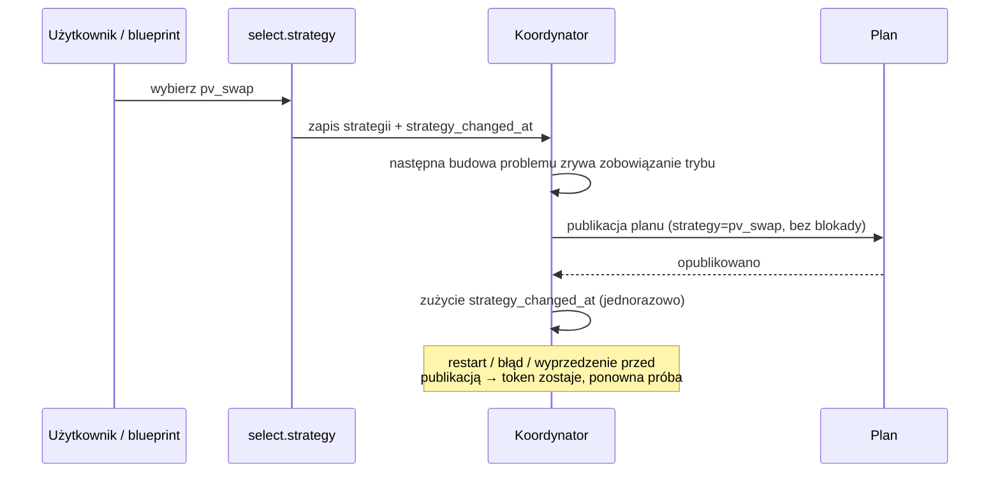

Zmiana strategii to **reset**: przeniesione zobowiązanie trybu jest zwalniane, aby nowa strategia
nie utknęła w minimalnym czasie starego trybu. Trwający epizod eksportu jest zachowany, żeby jego
próg nie został naliczony dwa razy.

## Automatyczne przełączanie strategii

Opcjonalny blueprint [`strategy_switch.yaml`](../blueprints/automation/energy_compass/strategy_switch.yaml)
wybiera jedną strategię na dobę. Działa o **14:05** (po publikacji cen RCE na następny dzień i
Solcast), ponawia co godzinę do **20:00**, jeśli brak cen na jutro, a przy starcie Home Assistant
dokańcza przerwany zapis.

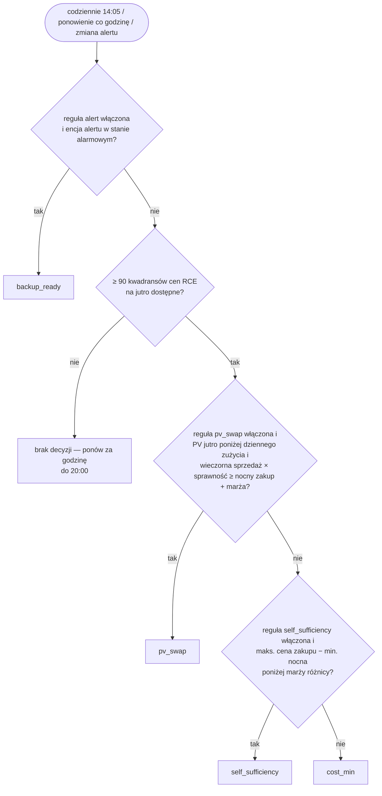

| Parametr | Domyślnie |
| --- | --- |
| Okno nocne | 22:00–06:00 (najniższa cena zakupu w przedziałach planu) |
| Maks. cena zakupu | najwyższa cena zakupu we wszystkich przedziałach planu |
| Okno wieczorne | 17:00–21:00 (najwyższa cena sprzedaży RCE na jutro) |
| Sprawność cyklu (round-trip) | 0,90 |
| Marża różnicy dla samowystarczalności | 0,15 PLN/kWh |
| Marża zamiany PV | 0,05 PLN/kWh |
| Włączone reguły | `alert`, `pv_swap`, `self_sufficiency` (`cost_min` to wartość awaryjna) |

**Ręczna** zmiana selecta blokuje reguły ekonomiczne do następnego udanego uruchomienia
planowego; reguła alertu nigdy nie jest blokowana. `max_export` i `grid_friendly` wybiera się
wyłącznie ręcznie. Konfiguracja: [przewodnik instalacji](installation.md#import-the-strategy-switch-blueprint)
(EN).

## Słownik kodów powodów

### Powody pokrycia / jakości (atrybuty `reason`, `reasons`)

| Kod | Znaczenie |
| --- | --- |
| `complete` | Pełne pokrycie odniesienia, wszystkie próby udane. |
| `available_reference_horizon` | Pokrycie źródeł krótsze niż żądany horyzont odniesienia; percentyle z dostępnych danych. |
| `reference_horizon_uncovered` | Zarezerwowany w tłumaczeniach; nie jest emitowany w 0.1.25. |
| `reference_probe_failed` | Co najmniej jedna próba odniesienia nie powiodła się lub zabrakło czasu. |
| `short_source_coverage` | Pokrycie cen/prognoz kończy się przed żądanym horyzontem planowania. |
| `current_guidance_unavailable` | Próba dla bieżącego przedziału nieznana; późniejsze okna mogą być poprawne. |
| `missing_forecast_continuation` | Skonfigurowane źródło nie opublikowało jeszcze danych dla części horyzontu (np. jutrzejsze ceny przed ok. 14:00). |
| `load_history_fallback` | Część prognozy zużycia używa zapasowego dziennego zużycia, bo historia jest niewystarczająca. |
| `unvalidated_tariff` | Kalibracja taryfy oznaczona jako `unvalidated`. |
| `unvalidated_capacity` | Kalibracja pojemności baterii oznaczona jako `unvalidated`. |

### Ostrzeżenia progu autonomii

| Kod | Znaczenie |
| --- | --- |
| `autonomy_floor_requires_pv` | Brak źródła PV — próg pominięty. |
| `autonomy_tail_coarsened` | Ogon 48 h dłuższy niż 192 przedziały, zgrubiony do godzin. |
| `autonomy_tail_unavailable` | Źródło ogona zawiodło; próg używa tylko horyzontu z cenami. |
| `grid_charge_ceiling_below_autonomy_weight` | Sufit ceny ładowania z sieci poniżej wagi progu − marża; progu nie dałoby się uzupełnić. |

### Wyjątki bezpieczeństwa (`dispatch_policy.safety_exception.reason`)

| Kod | Znaczenie |
| --- | --- |
| `observed_soc_maximum` | Aktywne zobowiązanie ładowania, a SOC już na maksimum. |
| `observed_soc_minimum` | Aktywne zobowiązanie rozładowania, a SOC na lub poniżej rezerwy. |
| `grid_charge_price_limit` | Przeniesione CHARGE_GRID kontynuowałoby powyżej sufitu ceny ładowania z sieci. |

### Ostrzeżenia balansowania

To są surowe kody, nietłumaczone.

| Kod | Znaczenie |
| --- | --- |
| `balance_overdue` | Faza balansu to `due`, ale w planie nie zmieściło się żadne okno trzymania; balans w tym horyzoncie został pominięty. |
| `balance_no_window_in_horizon` | Faza balansu to `eligible` lub `due`, ale w horyzoncie nie istnieje żadne kandydujące okno trzymania (żaden wyrównany start nie spełnia wymogów PV/ładowania z sieci). |
